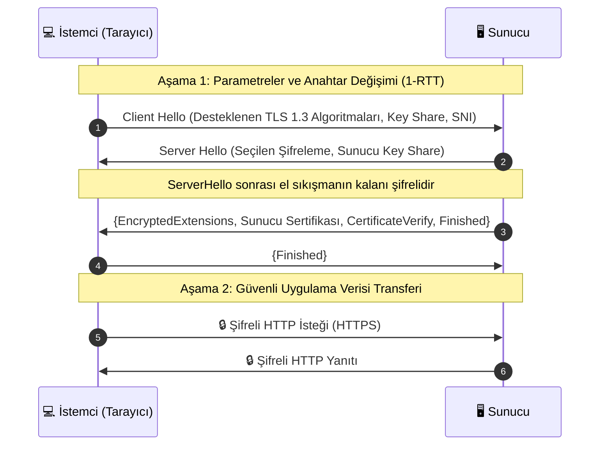
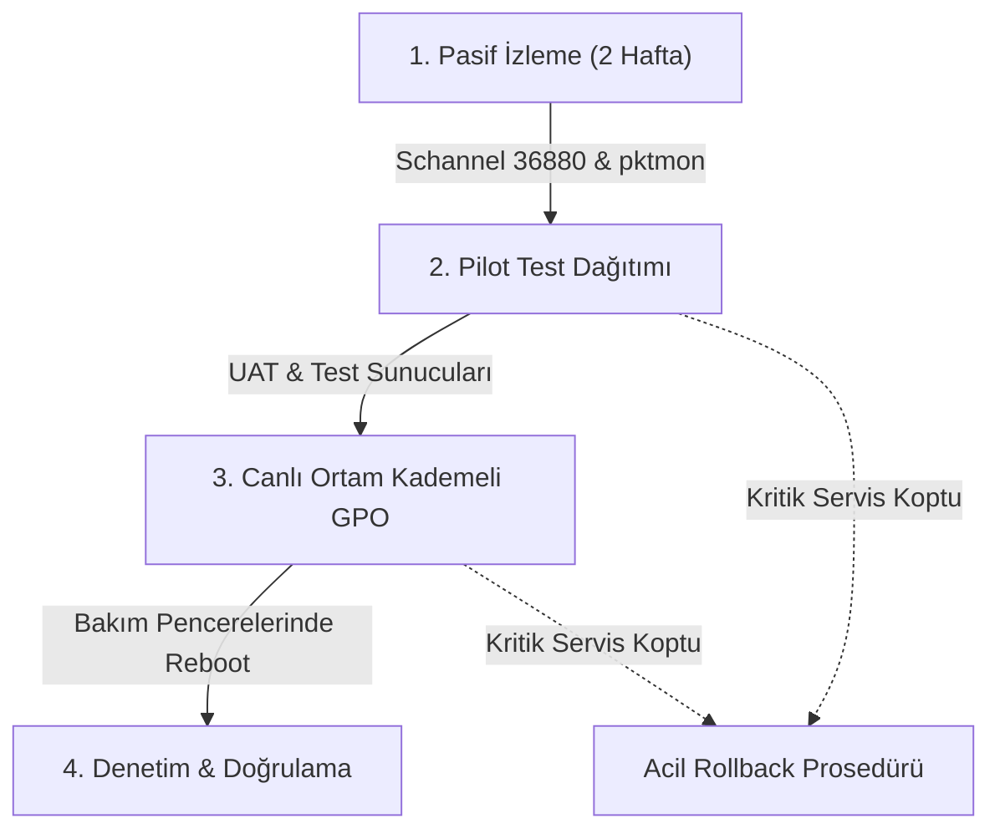

**TLS (Transport Layer Security - Taşıma Katmanı Güvenliği)** ve **SSL (Secure Sockets Layer - Güvenli Yuva Katmanı)**, internet gibi güvenli olmayan ağlar üzerinden gerçekleştirilen veri transferlerini şifreleyerek güvenli hale getiren kriptografik protokollerdir. İletişim sırasında şu üç temel güvenlik güvencesini sağlar:

1. **Gizlilik (Confidentiality):** Araya giren saldırganlar (eavesdropper) aktarılan verileri okuyamaz.
2. **Bütünlük (Integrity):** Alıcı, verinin iletim sırasında değiştirilmediğini veya kurcalanmadığını doğrulayabilir.
3. **Kimlik Doğrulama (Authentication):** İstemci, dijital sertifikalar sayesinde sunucunun gerçek kimliğini (ve karşılıklı TLS / mTLS ile sunucu da istemcinin kimliğini) doğrulayabilir.

---

## 1. Protokollere Genel Bakış

### SSL (Secure Sockets Layer)

Netscape Communications tarafından geliştirilen ve ilk olarak 1995 yılında SSL 2.0 sürümüyle yayımlanan SSL (SSL 1.0 ciddi güvenlik açıkları sebebiyle hiçbir zaman yayımlanmamıştır), internet üzerinde veri şifrelemenin öncüsü olmuş ve HTTPS protokolünün temelini atmıştır. Ancak SSL protokolleri yapısal kriptografik zafiyetlere sahip olduğundan (örneğin SSL 3.0'daki POODLE saldırısı) ve modern güvenlik ihtiyaçlarını karşılayamadığından zaman içinde yerini TLS'e bırakmıştır. Günümüzde **tüm SSL sürümleri (1.0, 2.0, 3.0) tamamen kullanımdan kaldırılmış olup güvensiz kabul edilmektedir**.

### TLS (Transport Layer Security)

TLS, SSL'in yerini almak üzere IETF (Internet Engineering Task Force) tarafından geliştirilmiş ve ilk olarak 1999 yılında [RFC 2246](https://datatracker.ietf.org/doc/html/rfc2246) ile yayımlanmıştır. TLS, SSL'in güvenlik açıklarından arındırılmış, çok daha gelişmiş ve güçlendirilmiş modern halefidir. Yıllar içinde 1.0, 1.1, 1.2 ve 1.3 sürümlerine evrilmiştir:

- **TLS 1.0 ve 1.1:** Zayıf şifreleme ve bütünlük algoritmaları (CBC dolgu zafiyetleri, SHA-1 ve MD5 bağımlılıkları) sebebiyle Mart 2021'de [RFC 8996](https://datatracker.ietf.org/doc/html/rfc8996) ile resmi olarak kullanımdan kaldırılmıştır (deprecated).
- **TLS 1.2 ([RFC 5246](https://datatracker.ietf.org/doc/html/rfc5246)):** Günümüzde internet genelinde aktif olarak kullanılan temel güvenlik protokolüdür.
- **TLS 1.3 ([RFC 8446](https://datatracker.ietf.org/doc/html/rfc8446)):** Modern internet güvenliğinin altın standardıdır. El sıkışma süresini 1-RTT'ye düşürür, zorunlu ileri gizlilik (Forward Secrecy) sunar ve eski/zayıf algoritmaları (MD5, SHA-1, RC4, DES, 3DES, statik RSA anahtar değişimi) büyük ölçüde ortadan kaldırmıştır.

---

## 2. SSL ve TLS Karşılaştırması

| Özellik / Metrik | SSL 2.0 / 3.0 | TLS 1.0 / 1.1 | TLS 1.2 | TLS 1.3 |
| :--- | :--- | :--- | :--- | :--- |
| **Yayımlanma Yılı** | 1995 / 1996 | 1999 / 2006 | 2008 | 2018 |
| **IETF Standart RFC** | Kullanım Dışı / RFC 6101 | RFC 2246 / RFC 4346 | RFC 5246 | RFC 8446 |
| **Güncel Güvenlik Durumu** | ⛔ Geçersiz / Güvensiz | ⛔ Kullanımdan Kaldırıldı (RFC 8996) | ✅ Güvenli (Temel Standart) | 🚀 En Yüksek Güvenlik (Önerilen) |
| **El Sıkışma Gecikmesi** | 2-RTT (Tam el sıkışma) | 2-RTT (Tam el sıkışma) | 2-RTT (Tam el sıkışma) | **1-RTT** (0-RTT Erken Veri desteği* / Tam el sıkışma) |
| **Anahtar Değişimi** | Statik RSA, DH | Statik RSA, DH, DHE | Statik RSA, DH, DHE, ECDHE** | **Yalnızca (EC)DHE `key_share` (Uzantı bazlı)*** |
| **Mesaj Doğrulama (MAC)** | Özel MAC (MD5/SHA-1 öncülü) | HMAC | SHA-256 / SHA-384 ile HMAC | **Yalnızca AEAD (Kimlik Doğrulamalı Şifreleme)** |
| **Bilinen Zafiyetler** | DROWN, POODLE (SSL 3.0), Padding Oracle | BEAST (TLS 1.0), Lucky Thirteen, POODLE-TLS | Doğru yapılandırıldığında güvenli | Eski geri düşürme ve CBC açıklarına karşı bağışık |

\* *0-RTT (Early Data), performansı artırsa da yeniden oynatma (replay) riski barındırır; bu sebeple yalnızca yan etkisi olmayan (idempotent) isteklerde kullanılmalıdır.*  
\** *TLS 1.2'de statik RSA anahtar değişimi İleri Gizlilik (Forward Secrecy - PFS) sağlamaz; yalnızca ECDHE/DHE paketleri PFS sunar.*  
\*** *TLS 1.3'te cipher suite tanımları anahtar değişimini içermez; anahtar değişimi `supported_groups` ve `key_share` uzantıları üzerinden bağımsız yürütülür.*

---

## 3. TLS Nasıl Çalışır? (Modern El Sıkışma Mimarisi)


Modern TLS hibrit bir kriptografik model kullanır: Uç noktaların kimliğini doğrulamak için **dijital imza**, oturum anahtarlarını güvenli biçimde oluşturmak için **(EC)DH anahtar anlaşması** kullanılır; ardından yüksek performanslı veri iletimi için **simetrik şifreleme** (AES-GCM veya ChaCha20-Poly1305 gibi AEAD) algoritmalarına geçilir.

### El Sıkışma Akışı (TLS 1.3 Örneği)



### El Sıkışma Adımlarının Detayları

1. **Client Hello ve Anahtar Paylaşımı:** İstemci; desteklediği TLS sürümlerini, şifreleme algoritmalarını (cipher suites) ve geçici açık anahtar parçasını (`KeyShare`) sunucuya iletir.
2. **Server Hello ve Kimlik Doğrulama:** Sunucu algoritmayı seçer, kendi anahtar parçasını döner, dijital sertifikasını (X.509) gönderir ve el sıkışma özetini (Transcript Hash) özel anahtarıyla imzalayarak (`CertificateVerify`) kimliğini kanıtlar.
3. **Oturum Anahtarının Türetilmesi:** Her iki taraf da ECDHE (Elliptic Curve Diffie-Hellman Ephemeral) anahtar anlaşmasıyla ortak gizli bilgiyi hesaplar ve HKDF (HMAC-based Extract-and-Expand Key Derivation Function) mekanizması ile oturum boyunca kullanılacak simetrik trafik anahtarlarını (traffic secrets) bağımsızca türetir.
4. **Şifreli Veri İletimi:** Tüm uygulama trafiği, yüksek hızlı AEAD simetrik şifreleme algoritmalarıyla korunur.
5. **Bağlantının Güvenli Sonlandırılması:** İletişim bittiğinde kesinti saldırılarını (truncation attacks) önlemek amacıyla kayıt katmanında (Record Layer) AEAD ile bütünlüğü korunmuş `close_notify` uyarısı iletilerek oturum güvenle kapatılır.

> [!WARNING]
> **TLS 1.3 0-RTT (Early Data) ve Yeniden Oynatma (Replay) Saldırısı Riski:**
> 0-RTT özelliği, istemcinin daha önceden tanıdığı bir sunucuya el sıkışmanın tamamlanmasını beklemeden ilk pakette veri göndermesini sağlar. Ancak bu veri İleri Gizlilik (PFS) sağlamaz ve aradaki saldırganın paketi kaydedip sunucuya tekrar göndermesine (Replay Attack) açıktır. Bu nedenle 0-RTT veri transferi; veritabanına yazan veya finansal işlem yapan `POST`/`PUT` isteklerinde kesinlikle engellenmeli, yalnızca uygulamanın replay saldırılarına karşı korumalı olduğu ve yan etkisiz (idempotent) isteklerle sınırlandırılmalıdır.

---

## 4. Eski SSL Nasıl Çalışıyordu? (Tarihsel Bağlam)


SSL protokolünün neden terk edildiğini anlamak için eski çalışma prensibini bilmek faydalıdır:

1. **İstemci Bağlantısı:** İstemci (örneğin web tarayıcısı) sunucuya bağlanır ve güvenli bağlantı isteğinde bulunur.
2. **Sunucu Kimlik Doğrulaması:** Sunucu, sertifika yetkilisi (CA) tarafından onaylanmış dijital sertifikasını ve bu sertifikanın içindeki **Açık Anahtarı (Public Key)** istemciye iletir.
   > [!IMPORTANT]
   > Sunucu **asla ve hiçbir zaman** özel anahtarını (Private Key) istemciye göndermez. Özel anahtar daima sunucuda gizli kalır. İstemciye yalnızca sertifika içindeki açık anahtar iletilir.
3. **Pre-Master Secret Oluşturma:** Eski SSL ve erken TLS RSA el sıkışmalarında istemci rastgele bir ön anahtar (pre-master secret) üretir, bunu sunucunun **açık anahtarıyla** şifreleyerek sunucuya gönderir. Bu veriyi yalnızca sunucu kendi **özel anahtarıyla (Private Key)** çözebilir.
4. **Simetrik Anahtarın Üretilmesi:** İki taraf da ön anahtarı kullanarak oturum boyunca kullanılacak simetrik şifreleme anahtarını türetir.
5. **Şifreli İletişim:** Veriler üretilen simetrik anahtar ile şifrelenerek güvenle aktarılır.
6. **Bağlantının Sonlandırılması:** Oturum bittiğinde bağlantı kapatılır ve geçici anahtarlar silinir.

> [!WARNING]
> Eski SSL'de statik RSA kullanıldığında **İleri Gizlilik (Perfect Forward Secrecy - PFS)** bulunmazdı. Bir saldırgan bugün şifreli trafiği kaydeder ve yıllar sonra sunucunun özel anahtarını ele geçirirse geçmişe dönük tüm oturumları çözebilirdi. Modern TLS (özellikle standart el sıkışmada TLS 1.3), (EC)DHE zorunluluğu ile her yeni oturum için benzersiz geçici anahtarlar türeterek güçlü ileri gizlilik sağlar *(oturum devamlılığı ve 0-RTT erken verisi hariç)*.

---

## 5. TLS ⚔️ SSL: Temel Farklar


Günlük dilde web sertifikalarından bahsederken alışkanlıkla hâlâ "SSL" ifadesi kullanılsa da, gerçekte SSL protokolleri modern internette tamamen kullanımdan kaldırılmıştır:

- **Güvenlik ve Şifreleme:** SSL; çarpışma (collision) ve dolgu oraklı (padding oracle) saldırılara açık eski şifreleme yöntemlerine dayanıyordu. TLS 1.3 yalnızca entegre kimlik doğrulamalı AEAD şifreleyicileri destekler.
- **El Sıkışma Hızı:** SSL ve TLS 1.2 güvenli bağlantıyı kurmak için tam el sıkışmada (full handshake) 2 gidiş-dönüş süresine (2-RTT) ihtiyaç duyarken, TLS 1.3 bunu **1-RTT**'ye indirerek bağlantı hızını belirgin biçimde artırmıştır.
- **El Sıkışma Şifrelemesi ve Gizlilik:** TLS 1.2 ve önceki sürümlerde sunucu sertifikası dahil el sıkışma mesajlarının büyük kısmı ağ üzerinden açık (şifresiz) iletilirdi. TLS 1.3'te ise `Server Hello` hemen sonrasındaki tüm el sıkışma (sertifika dahil) şifrelenerek dinleme ve kurcalamaya karşı korunur.
- **Mesaj Bütünlüğü ve Doğrulama:** SSL 3.0, MD5 ve SHA-1 tabanlı özel bir MAC yapısı kullanıyordu. TLS 1.0–1.2 standart HMAC (RFC 2104) mimarisine geçerken; TLS 1.3 bağımsız MAC adımlarını tamamen kaldırarak bütünlük doğrulamasını doğrudan AEAD şifreleme motoruna entegre etmiştir.

---

## 6. SSL ve TLS'in En Yaygın Kullanım Alanları

- **Güvenli Web İletişimi (HTTPS):** Standart 80 numaralı HTTP portu yerine 443 numaralı port üzerinden tüm web trafiğini şifreler. Günümüzde HTTPS kullanan her web sitesi arka planda TLS çalıştırmaktadır.
- **E-posta Güvenliği:**
  - **Port 465 (SMTPS / Implicit TLS):** Bağlantının en başından itibaren TLS ile şifrelendiği doğrudan güvenli e-posta gönderim portudur.
  - **Port 587 (Submission / Explicit TLS):** Bağlantının başlangıçta düz metin kurulup `STARTTLS` komutuyla şifreli oturuma yükseltildiği modern istemci e-posta gönderim portudur.
  - **IMAPS / POP3S (Port 993 / 995):** Posta kutusu okuma işlemlerini implicit TLS tüneliyle şifreler.
- **Sanal Özel Ağlar (VPN):** OpenVPN, SSTP ve Cisco AnyConnect gibi çözümler ağ trafiğini tünellemek için TLS protokolünü kullanır.
- **Güvenli Dosya Aktarımı:**
  - **FTPS (FTP over SSL/TLS):** Standart FTP protokolünün TLS ile şifrelenmiş halidir.
  > [!NOTE]
  > **SFTP** (SSH File Transfer Protocol) ve **SCP** protokolleri SSL/TLS kullanmaz; bu protokoller **SSH** (Secure Shell) mimarisi üzerinde çalışır.
- **Mikroservis ve API İletişimi:** REST API'ler ve modern gRPC servisleri üretimde genellikle HTTP/2 üzerinde TLS (özellikle karşılıklı doğrulama / mTLS) mimarisiyle çalışır (düz metin h2c teknik olarak mümkün olsa da sıfır güven mimarilerinde TLS standarttır).

### HTTP ile HTTPS Arasındaki Temel Fark

- **HTTP (Hypertext Transfer Protocol):** Verileri TCP 80 portu üzerinden düz metin (cleartext) olarak iletir. Ağdaki yönlendirici, Wi-Fi veya aracı cihazlara erişimi olan herkes veriyi dinleyebilir (sniffing) ve değiştirebilir (MitM).
- **HTTPS (HTTP Secure):** HTTP protokolünün TLS tüneli içerisine alınmış halidir (genellikle port 443). İletilen veriler ağ dinleyicileri (eavesdropping) ve araya giren yetkisiz taraflarca okunamaz ve değiştirilemez *(kurumsal SSL Inspection / TLS termination yapan yetkili proxy veya WAF cihazları hariç)*.  
  *(Not: HTTP/1.1 ve HTTP/2 protokolleri standart TCP/TLS üzerinde çalışırken; modern **HTTP/3** protokolü doğrudan UDP tabanlı QUIC taşıma katmanı üzerinde yerleşik TLS 1.3 şifrelemesi kullanır).*

---

## 7. SSL/TLS Sürümlerini Denetleme ve Test Etme

### 7.1 Güvenli ve Güvensiz Protokol Seviyeleri

| Protokol | Durum | Gerekli Eylem |
| :--- | :--- | :--- |
| **SSL 2.0** | 🔴 Kritik Güvenlik Açığı | Derhal devre dışı bırakılmalı |
| **SSL 3.0** | 🔴 Kritik Güvenlik Açığı (POODLE) | Derhal devre dışı bırakılmalı |
| **PCT 1.0** | 🔴 Eski ve Geçersiz | Derhal devre dışı bırakılmalı |
| **TLS 1.0** | 🔴 Kullanımdan Kaldırıldı (RFC 8996) | Derhal devre dışı bırakılmalı |
| **TLS 1.1** | 🔴 Kullanımdan Kaldırıldı (RFC 8996) | Derhal devre dışı bırakılmalı |
| **TLS 1.2** | 🟢 Güvenli | **Etkinleştirilmeli** (Sunucu ve İstemci) |
| **TLS 1.3** | 🟢 Modern Standart | **Etkinleştirilmeli** (Windows Server 2022/2025, modern Linux) |

### 7.2 Harici Test ve Denetim Araçları

1. **Qualys SSL Labs:** [https://www.ssllabs.com/ssltest/](https://www.ssllabs.com/ssltest/) (Genel web sunucuları için endüstri standardı güvenlik testi; *yalnızca internete açık IP/domainlerde çalışır, yerel ağda kullanılamaz*).
2. **Nartac IIS Crypto:** [https://www.nartac.com/Products/IISCrypto](https://www.nartac.com/Products/IISCrypto) (Windows SCHANNEL protokollerini yönetmek için kullanımı kolay grafik arayüz aracı).
3. **OpenSSL CLI ile Test Etme:**

   ```bash
   # Eski TLS 1.0 desteğini test etme (istemci kütüphanesi izin veriyorsa; sunucu reddetmeli)
   openssl s_client -connect alanadiniz.com:443 -tls1

   # Modern TLS 1.3 desteğini doğrulama
   openssl s_client -connect alanadiniz.com:443 -tls1_3
   ```

   > [!WARNING]
   > **OpenSSL 3.x ve RHEL Crypto-Policies İstemci Yanılgısı:**
   > Modern Linux dağıtımlarında (Ubuntu 22.04+, RHEL 9+, Debian 12+) OpenSSL 3.x varsayılan olarak istemci tarafında TLS 1.0 ve 1.1'i engeller (`SECLEVEL=2`). Bu durumda `openssl s_client -tls1` komutu sunucu TLS 1.0 desteklese dahi istemcinin kendi içinde kapanır ve sunucunun güvenli olduğu yanılgısını yaratır.
   > Güvenlik seviyesini düşürmek için `-cipher "DEFAULT:@SECLEVEL=0"` eklense dahi, RHEL 9 gibi sistem geneli `crypto-policies` kullanan ortamlarda işletim sistemi protokolü kütüphane seviyesinde kapattığı için istemci yine `no protocols available` hatası verebilir. Bu hata sunucunun yanıtını değil, istemcinin kısıtını gösterir ve testi **geçersiz kılar**. Benzer şekilde `curl --tlsv1.0` komutunun hata vermesi de istemci politikasından kaynaklanabilir. Yanılgısız ve kesin sonuç için doğrudan `nmap` veya `testssl.sh` kullanılmalıdır.

4. **Nmap ile Şifreleme Paketlerini Tarama:**

   ```bash
   nmap --script ssl-enum-ciphers -p 443 alanadiniz.com
   ```

---

### 7.3 Kurumsal ve Yerel Ağda (Domain / İntranet) SSL/TLS Sorgulama

Kurum içinde Active Directory, yerel dosya sunucuları (NAS) veya iç web uygulamaları bulunuyorsa Qualys SSL Labs gibi internet tabanlı testler kullanılamaz. Bunun yerine şu yerel denetim yöntemleri uygulanmalıdır:

#### 7.3.1 Yerel Bilgisayarda / İstemcide Aktif Protokolleri Sorgulama (PowerShell)

Kendi Windows bilgisayarınızda veya bir sunucuda hangi protokollerin manuel olarak açılıp kapatıldığını net bir hiyerarşiyle görmek için şu komutu çalıştırabilirsiniz:

```powershell
$base = "HKLM:\SYSTEM\CurrentControlSet\Control\SecurityProviders\SCHANNEL\Protocols"

$sonuc = foreach ($p in "SSL 2.0","SSL 3.0","TLS 1.0","TLS 1.1","TLS 1.2","TLS 1.3") {
    foreach ($role in "Server","Client") {
        $v = Get-ItemProperty "$base\$p\$role" -ErrorAction SilentlyContinue
        [pscustomobject]@{
            Protokol = $p
            Rol      = $role
            Durum    = if ($null -eq $v -or $null -eq $v.Enabled) { "Varsayılan" }
                       elseif ($v.Enabled -eq 0) { "KAPALI" }
                       else { "AÇIK" }
        }
    }
}

$sonuc | Format-Table -AutoSize
```

> [!NOTE]
> **Kayıt Defteri Boş Çıkarsa veya Klasörlerin İçi Boşsa Ne Anlama Gelir?**
>
> - **Tamamen Boş Çıkması:** Windows'ta `Protocols` altında kayıt yoksa sistem hata vermez; **"İşletim Sistemi Varsayılanları" (OS Default)** geçerlidir. ([Microsoft Dokümantasyonu: Protocols in TLS/SSL - Schannel SSP](https://learn.microsoft.com/en-us/windows/win32/secauthn/protocols-in-tls-ssl--schannel-ssp-) ve [Kullanımdan Kaldırılan Özellikler Listesi](https://learn.microsoft.com/en-us/windows/whats-new/deprecated-features) doğrultusunda):
>   - *Windows Server 2016 / 2019 & Windows 10:* SSL 2.0/3.0 kapalı; TLS 1.0, 1.1 ve 1.2 varsayılan olarak açıktır (yerel TLS 1.3 desteği bulunmaz).
>   - *Windows Server 2022 & Windows 11:* TLS 1.2 ve TLS 1.3 varsayılan olarak etkindir. TLS 1.0 ve 1.1 Schannel motorunda desteklenmeye devam etse de modern istemciler ve tarayıcı seviyelerinde sınırlandırılmıştır.
>   - *Windows Server 2025 & Windows 11 24H2:* TLS 1.0 ve 1.1 sistem genelinde varsayılan olarak devre dışı (disabled by default) bırakılmıştır.
> - **`TLS 1.0` Klasörü Var Ama İçi Boşsa:** Windows motoru bu klasörü **genellikle yok hükmünde sayar**. SCHANNEL yalnızca `Client` veya `Server` altındaki `Enabled` ve `DisabledByDefault` (DWORD) değerlerine bakar. Altında değer olmayan bir klasör işletim sisteminin çalışmasını **genellikle etkilemez**.

#### 7.3.2 Domain Controller Üzerinde Schannel Loglama ve İstemci IP Tespiti

Eski protokolleri kapatmadan önce kurumda **"Kimler hâlâ eski TLS 1.0/1.1 ile bağlanıyor?"** sorusunu tespit etmek için Domain Controller'da olay günlüğü seviyesi artırılmalıdır:

```powershell
# SCHANNEL Olay Günlüğünü Aktifleştirme (Yönetici PowerShell)
reg add "HKLM\SYSTEM\CurrentControlSet\Control\SecurityProviders\SCHANNEL" /v "EventLogging" /t REG_DWORD /d 7 /f
```

- **Olay Görüntüleyici (Event Viewer) Kontrolü:** `Windows Logs` ➔ `System` altında Kaynak: **Schannel** filtresi uygulayın.
- **Temel Schannel Olay Kimlikleri (Event IDs):**
  - **Event ID 36880:** Başarılı bir SSL/TLS el sıkışmasını ve müzakere edilen protokol/şifreleme paketini gösterir.
  - **Event ID 36874:** El sıkışma başarısızlığını (istemci ile sunucu arasında ortak protokol veya şifreleme paketi bulunamadığında uyuşmazlık hatasını) bildirir.
  *(Not: İstemci veya sunucu tarafından bir ölümcül hata uyarısı üretildiğinde veya alındığında ise sırasıyla Event ID 36888 ve 36887 tetiklenir).*

> [!IMPORTANT]
> **Schannel Logları İstemci IP Adresi İçermez!**
> Schannel olayları bağlantının IP adresi gibi ağ katmanı meta verilerini taşımaz. Eski TLS kullanan **cihazların IP adreslerini kesin olarak bulmak** için şu yöntemler kullanılmalıdır:
>
> 1. **LDAPS (Port 636) için Ağ Seviyesinde Paket İzleme (`pktmon`):** DC üzerinde yerel paket izleme aracıyla LDAPS trafiği yakalanıp pcapng formatına dönüştürülebilir:
>
>    ```cmd
>    # 636 portu için filtre tanımlama ve yakalamayı başlatma
>    pktmon filter add -p 636
>    pktmon start --capture --file-name ldaps.etl
>
>    # Trafik oluştuktan sonra durdurma ve Wireshark formatına dönüştürme
>    pktmon stop
>    pktmon etl2pcap ldaps.etl --out ldaps.pcapng
>    ```
>
>    Oluşturulan `ldaps.pcapng` dosyası Wireshark ile açılıp `tls.handshake.type == 1` filtresi uygulandığında, gelen **Client Hello** paketlerindeki kaynak IP adresi ve istemcinin talep ettiği TLS sürümü (`supported_versions` veya `Handshake Version`) analiz edilebilir.
> 2. **IIS Web Siteleri için W3C Log Alanlarına Server Variable Ekleme:** IIS Yöneticisi'nde sunucu veya site düzeyinde `Logging` (Günlüğe Kaydetme) ➔ `Select Fields` ➔ `Custom Fields` altından iki özel alan eklenir:
>    - **Protokol:** Alan Adı: `Crypt-Protocol`, Kaynak Türü: `Server Variable`, Kaynak Adı: `CRYPT_PROTOCOL`
>    - **Şifreleme Algoritması:** Alan Adı: `Crypt-Cipher`, Kaynak Türü: `Server Variable`, Kaynak Adı: `CRYPT_CIPHER_ALG_ID`
>
>    *(Önemli Not: IIS bu sunucu değişkenlerini okunabilir metin yerine onaltılık - hexadecimal sayısal kodlar olarak kaydeder. Örneğin `CRYPT_PROTOCOL` sütununda: `0x0080` = TLS 1.0, `0x0200` = TLS 1.1, `0x0800` = TLS 1.2, `0x2000` = TLS 1.3 anlamına gelir. Log analizinde bu onaltılık kodlar filtrelenerek eski TLS kullanan istemcilerin IP adresleri raporlanabilir).*

**LDAP İmzalama (Signing) Denetimi (Event ID 2889):** DC'de `NTDS\Diagnostics` altındaki `16 LDAP Interface Events = 2` ayarı açıldığında düşen **Event ID 2889**, TLS sürümünü değil; port 389 üzerinden imzasız (unsigned) veya düz metin basit kimlik doğrulaması (simple bind) yapan istemcilerin IP'lerini raporlar.

#### 7.3.3 Nmap ile Kurum İçi Subnet Taraması (Merkezi Denetim)

İç ağdaki tüm IP'leri; Web (443), Active Directory LDAPS (636) ve RDP (3389) portları üzerinden tarayarak eski protokol kullanan cihazları tek raporda toplayabilirsiniz:

```bash
nmap --script ssl-enum-ciphers -p 443,636,3389 192.168.1.0/24 -oN kurum_tls_raporu.txt
```

#### 7.3.4 Linux Sistemlerde SSL/TLS Sorgulama ve Yerel Denetim

Linux sistemlerde merkezi bir kayıt defteri (`Registry`) bulunmadığından denetimler komut satırı araçlarıyla gerçekleştirilir:

1. **`testssl.sh` ile Kapsamlı Yerel Raporlama (En Kapsamlı Araç):**
   Linux dünyasının Qualys SSL Labs eşdeğeridir. Dış internete çıkmadan iç IP'leri ve yerel servisleri tüm zafiyetlere (POODLE, BEAST, Heartbleed, zayıf cipher'lar) karşı tarar:

   ```bash
   git clone --depth 1 https://github.com/drwetter/testssl.sh.git
   cd testssl.sh
   # Yerel servisi veya iç ağdaki bir IP'yi test etme
   ./testssl.sh localhost:443
   ./testssl.sh 192.168.1.50:443
   ```

2. **OpenSSL ve cURL ile Manuel Doğrulama:**

   ```bash
   # Eski TLS 1.0 el sıkışmasını deneme (güvenlik seviyesi düşürülerek sunucu testi)
   openssl s_client -connect localhost:443 -tls1 -cipher "DEFAULT:@SECLEVEL=0"
   
   # Modern TLS 1.2 ve TLS 1.3 el sıkışmasını test etme (başarılı olmalı)
   openssl s_client -connect localhost:443 -tls1_2
   openssl s_client -connect localhost:443 -tls1_3

   # cURL ile maksimum TLS sınırlandırmasıyla test
   curl -Iv --tlsv1.0 --tls-max 1.0 https://localhost
   curl -Iv --tlsv1.3 https://localhost
   ```

   > [!WARNING]
   > **İstemci Kütüphanesi ve Politika Engeli:**
   > RHEL 9 gibi sistem geneli `crypto-policies` kullanan ortamlarda TLS 1.0/1.1 işletim sistemi düzeyinde tamamen devreden çıkarılmış olabilir. Bu durumda istemci `no protocols available` hatası verebilir. Bu durum sunucunun durumunu değil istemcinin kısıtını yansıtır ve testi geçersiz kılar. Benzer şekilde `curl --tlsv1.0` istemci kütüphanesi sebebiyle yerelde hata verebilir. Kesin ve yanılgısız tespit için her zaman `nmap` veya `testssl.sh` kullanılmalıdır.

3. **İşletim Sistemi Politikasını Sorgulama (RHEL / AlmaLinux / Rocky):**

   ```bash
   update-crypto-policies --show
   # Çıktı: DEFAULT, LEGACY veya FUTURE
   ```

---

## 8. Sunucu Sıkılaştırma ve Güvenlik Düzeltmeleri

### 8.1 Kurumsal Ortam (Active Directory, NAS, .NET) Risk Analizi

Sunucularda veya istemcilerde doğrudan TLS 1.0 ve TLS 1.1 protokollerini kapatmadan önce aşağıdaki kurumsal bağımlılıklar kontrol edilmelidir:

1. **NAS ve Depolama Cihazları (LDAPS & Web Arayüzü):**
   - NAS cihazınız Active Directory üzerinden kullanıcı doğrulaması yapıyorsa ve **LDAPS (Port 636)** kullanıyorsa, NAS firmware'i TLS 1.2 desteklemiyorsa AD iletişimi kopar ve dosya paylaşımlarına erişim engellenir.
   - Eski NAS yönetim web panelleri (HTTPS) sadece TLS 1.0 destekliyorsa, istemcilerde TLS 1.0 kapatıldığında tarayıcılar yönetim paneline erişimi reddeder.
2. **.NET Framework StrongCrypto Tuzağı:**
   - .NET 3.5, 4.0 ve 4.5 tabanlı kurumsal uygulamalar (ERP, muhasebe yazılımları, iç araçlar), kayıt defterinde güçlü şifreleme zorlanmadığı ve ilgili KB güncellemeleri uygulanmadığı sürece **varsayılan olarak TLS 1.0** kullanmaya çalışır. İşletim sisteminde TLS 1.0 kapatıldığında bu uygulamalar SQL Server'a veya web servislerine bağlanırken çöker.
3. **Uzak Masaüstü (RDP / CredSSP) Kilitlenme Riski:**
   - RDP bağlantıları Ağ Düzeyinde Kimlik Doğrulama (NLA) sırasında CredSSP protokolünü SCHANNEL TLS tüneli içinde çalıştırır. İstemci ile sunucu cipher paketleri uyuşmazsa sunucuya uzaktan erişim tamamen kesilebilir.
4. **Ağ Yazıcıları ve Fotokopi Cihazları (MFP):**
   - Tarayıcıların "Scan-to-Email" veya "LDAP Adres Defteri" özellikleri genellikle eski donanımlarda TLS 1.0 ile çalışır.

---

### 8.2 Windows Server & İstemci (SCHANNEL Kayıt Defteri Sıkılaştırması)

Windows işletim sistemlerinde şifreleme protokolleri `SCHANNEL` kayıt defteri alanı üzerinden yönetilir:

```text
HKLM\SYSTEM\CurrentControlSet\Control\SecurityProviders\SCHANNEL\Protocols
```

#### `Enabled` ve `DisabledByDefault` Değerlerinin Birlikte Çalışma Mantığı

SCHANNEL motoru el sıkışma parametrelerini belirlerken hem `Enabled` hem de `DisabledByDefault` anahtarlarını değerlendirir:

- **`Enabled = 0`:** İlgili protokolü sistem genelinde devre dışı bırakır (Schannel kullanan istemci veya sunucu bu protokolü müzakere edemez).
- **`DisabledByDefault = 1`:** Uygulama veya servis el sıkışmada protokolü özellikle belirtmediğinde (varsayılan işletim sistemi listesini kullandığında) bu protokolün el sıkışma teklifine eklenmesini engeller.
- **Güvenli Sıkılaştırma Kombinasyonu:** Kapatılmak istenen protokollerde `Enabled = 0` ve `DisabledByDefault = 1` ikilisinin birlikte uygulanması, Schannel güvenlik sağlayıcısını kullanan tüm Windows bileşenlerinde protokolün hem varsayılan hem de doğrudan çağrılarda devre dışı kalmasını sağlar.

**Schannel SSP Kapsamı Uyarısı:** Bu kayıt defteri ayarları yalnızca Windows'un yerel **Schannel (SSP)** kriptografi motorunu kullanan servisleri (IIS, RDP, SQL Server, IE/Edge, LDAP/LDAPS, Exchange vb.) etkiler. Sunucu üzerinde çalışan ve kendi yerel TLS yığınını getiren yazılımlar (OpenSSL kullanan Apache/Nginx, Java JDK/JSSE, yerleşik Go ikili dosyaları) bu ayarlardan etkilenmez; bu yazılımların kendi yapılandırma dosyalarından sıkılaştırılması gerekir.

> [!CAUTION]
> **Yeniden Başlatma (Reboot) Önerisi:**
> Microsoft, SCHANNEL kayıt defteri değişikliklerinin ardından sistemin yeniden başlatılmasını (reboot) resmi olarak önerir. Değişiklikler, Schannel SSP motorunu kullanan temel sistem süreçleri ve servisler (Lsass, HTTP.sys, IIS, RDS/CredSSP) ayarları yeniden yükleyene kadar tam olarak yürürlüğe girmez; üretim ortamında tutarlı ve eksiksiz bir geçiş için sunucunun bakım penceresinde yeniden başlatılması en güvenli yaklaşımdır.

#### Kurumsal Referans Kayıt Defteri Şablonu (`Disable-Legacy-Enable-Modern.reg`)

> [!NOTE]
> Aşağıdaki kayıt defteri dosyası kurumsal bir referans şablonudur. Canlı ortama basılmadan önce ortamınızdaki özel servisler ve test sunucularında doğrulanmalıdır. Dosya; eski protokolleri kapatır, modern TLS 1.2 ve TLS 1.3'ü etkinleştirir, güvensiz şifreleyicileri (Sweet32 / 3DES, RC4, MD5) engeller ve .NET uygulamalarının çökmemesi için **StrongCrypto** zorunluluğunu (.NET yama seviyelerine bağlı olarak) sisteme işler:

```reg
Windows Registry Editor Version 5.00

; ========================================================
; Eski ve Güvensiz Protokolleri Devre Dışı Bırakma
; ========================================================
[HKEY_LOCAL_MACHINE\SYSTEM\CurrentControlSet\Control\SecurityProviders\SCHANNEL\Protocols\Multi-Protocol Unified Hello\Client]
"Enabled"=dword:00000000
"DisabledByDefault"=dword:00000001

[HKEY_LOCAL_MACHINE\SYSTEM\CurrentControlSet\Control\SecurityProviders\SCHANNEL\Protocols\Multi-Protocol Unified Hello\Server]
"Enabled"=dword:00000000
"DisabledByDefault"=dword:00000001

[HKEY_LOCAL_MACHINE\SYSTEM\CurrentControlSet\Control\SecurityProviders\SCHANNEL\Protocols\PCT 1.0\Client]
"Enabled"=dword:00000000
"DisabledByDefault"=dword:00000001

[HKEY_LOCAL_MACHINE\SYSTEM\CurrentControlSet\Control\SecurityProviders\SCHANNEL\Protocols\PCT 1.0\Server]
"Enabled"=dword:00000000
"DisabledByDefault"=dword:00000001

; ========================================================
; Güvensiz SSL 2.0 ve SSL 3.0 Protokollerini Kapatma
; ========================================================
[HKEY_LOCAL_MACHINE\SYSTEM\CurrentControlSet\Control\SecurityProviders\SCHANNEL\Protocols\SSL 2.0\Client]
"Enabled"=dword:00000000
"DisabledByDefault"=dword:00000001

[HKEY_LOCAL_MACHINE\SYSTEM\CurrentControlSet\Control\SecurityProviders\SCHANNEL\Protocols\SSL 2.0\Server]
"Enabled"=dword:00000000
"DisabledByDefault"=dword:00000001

[HKEY_LOCAL_MACHINE\SYSTEM\CurrentControlSet\Control\SecurityProviders\SCHANNEL\Protocols\SSL 3.0\Client]
"Enabled"=dword:00000000
"DisabledByDefault"=dword:00000001

[HKEY_LOCAL_MACHINE\SYSTEM\CurrentControlSet\Control\SecurityProviders\SCHANNEL\Protocols\SSL 3.0\Server]
"Enabled"=dword:00000000
"DisabledByDefault"=dword:00000001

; ========================================================
; Kullanımdan Kalkan TLS 1.0 ve TLS 1.1'i Kapatma (RFC 8996)
; ========================================================
[HKEY_LOCAL_MACHINE\SYSTEM\CurrentControlSet\Control\SecurityProviders\SCHANNEL\Protocols\TLS 1.0\Client]
"Enabled"=dword:00000000
"DisabledByDefault"=dword:00000001

[HKEY_LOCAL_MACHINE\SYSTEM\CurrentControlSet\Control\SecurityProviders\SCHANNEL\Protocols\TLS 1.0\Server]
"Enabled"=dword:00000000
"DisabledByDefault"=dword:00000001

[HKEY_LOCAL_MACHINE\SYSTEM\CurrentControlSet\Control\SecurityProviders\SCHANNEL\Protocols\TLS 1.1\Client]
"Enabled"=dword:00000000
"DisabledByDefault"=dword:00000001

[HKEY_LOCAL_MACHINE\SYSTEM\CurrentControlSet\Control\SecurityProviders\SCHANNEL\Protocols\TLS 1.1\Server]
"Enabled"=dword:00000000
"DisabledByDefault"=dword:00000001

; ========================================================
; Güvenli TLS 1.2 Protokolünü Etkinleştirme
; ========================================================
[HKEY_LOCAL_MACHINE\SYSTEM\CurrentControlSet\Control\SecurityProviders\SCHANNEL\Protocols\TLS 1.2\Client]
"Enabled"=dword:00000001
"DisabledByDefault"=dword:00000000

[HKEY_LOCAL_MACHINE\SYSTEM\CurrentControlSet\Control\SecurityProviders\SCHANNEL\Protocols\TLS 1.2\Server]
"Enabled"=dword:00000001
"DisabledByDefault"=dword:00000000

; ========================================================
; Güvenli TLS 1.3 Protokolünü Etkinleştirme (Windows Server 2022/2025 & Windows 11)
; ========================================================
[HKEY_LOCAL_MACHINE\SYSTEM\CurrentControlSet\Control\SecurityProviders\SCHANNEL\Protocols\TLS 1.3\Client]
"Enabled"=dword:00000001
"DisabledByDefault"=dword:00000000

[HKEY_LOCAL_MACHINE\SYSTEM\CurrentControlSet\Control\SecurityProviders\SCHANNEL\Protocols\TLS 1.3\Server]
"Enabled"=dword:00000001
"DisabledByDefault"=dword:00000000

; ========================================================
; Zayıf Şifreleyicileri Kapatma (Sweet32 / 3DES, RC4 ve MD5 Engeli)
; ========================================================
[HKEY_LOCAL_MACHINE\SYSTEM\CurrentControlSet\Control\SecurityProviders\SCHANNEL\Ciphers\Triple DES 168]
"Enabled"=dword:00000000

[HKEY_LOCAL_MACHINE\SYSTEM\CurrentControlSet\Control\SecurityProviders\SCHANNEL\Ciphers\RC4 128/128]
"Enabled"=dword:00000000

[HKEY_LOCAL_MACHINE\SYSTEM\CurrentControlSet\Control\SecurityProviders\SCHANNEL\Ciphers\RC4 40/128]
"Enabled"=dword:00000000

[HKEY_LOCAL_MACHINE\SYSTEM\CurrentControlSet\Control\SecurityProviders\SCHANNEL\Ciphers\RC4 56/128]
"Enabled"=dword:00000000

[HKEY_LOCAL_MACHINE\SYSTEM\CurrentControlSet\Control\SecurityProviders\SCHANNEL\Hashes\MD5]
"Enabled"=dword:00000000

; ========================================================
; .NET Framework Güçlü Şifreleme (StrongCrypto) Zorunluluğu (64-bit ve 32-bit)
; ========================================================
[HKEY_LOCAL_MACHINE\SOFTWARE\Microsoft\.NETFramework\v4.0.30319]
"SchUseStrongCrypto"=dword:00000001
"SystemDefaultTlsVersions"=dword:00000001

[HKEY_LOCAL_MACHINE\SOFTWARE\WOW6432Node\Microsoft\.NETFramework\v4.0.30319]
"SchUseStrongCrypto"=dword:00000001
"SystemDefaultTlsVersions"=dword:00000001

; Legacy .NET Framework 2.0 / 3.5 Desteği (Varsa eski kurumsal yazılımlar için)
[HKEY_LOCAL_MACHINE\SOFTWARE\Microsoft\.NETFramework\v2.0.50727]
"SchUseStrongCrypto"=dword:00000001
"SystemDefaultTlsVersions"=dword:00000001

[HKEY_LOCAL_MACHINE\SOFTWARE\WOW6432Node\Microsoft\.NETFramework\v2.0.50727]
"SchUseStrongCrypto"=dword:00000001
"SystemDefaultTlsVersions"=dword:00000001
```

---

### 8.3 Windows Cipher Suite Sıralaması ve DH Anahtar Boyutu (GPO)

Yalnızca protokol anahtarlarını değiştirmek, bağlantı sırasında hangi şifreleme paketinin (cipher suite) öncelikli seçileceğini tam olarak belirlemez. İleri Gizlilik (Forward Secrecy - ECDHE) sağlayan modern paketleri en üste taşımak ve zayıf Diffie-Hellman anahtarlarını (Logjam atağı) engellemek için şu iki adım uygulanmalıdır:

#### 1. GPO ile SSL Cipher Suite Sırası Tanımlama

Group Policy Management Console üzerinde şu ilke yoluna gidin:
`Computer Configuration` ➔ `Administrative Templates` ➔ `Network` ➔ `SSL Configuration Settings` ➔ **SSL Cipher Suite Order**.

İlkeyi **Enabled** yapın ve *SSL Cipher Suites* alanına aşağıdaki virgülle ayrılmış modern paket listesini yapıştırın (satır atlamadan tek satır halinde):

```text
TLS_AES_256_GCM_SHA384,TLS_AES_128_GCM_SHA256,TLS_ECDHE_ECDSA_WITH_AES_256_GCM_SHA384,TLS_ECDHE_ECDSA_WITH_AES_128_GCM_SHA256,TLS_ECDHE_RSA_WITH_AES_256_GCM_SHA384,TLS_ECDHE_RSA_WITH_AES_128_GCM_SHA256,TLS_DHE_RSA_WITH_AES_256_GCM_SHA384,TLS_DHE_RSA_WITH_AES_128_GCM_SHA256
```

> [!IMPORTANT]
> **Windows'ta TLS 1.3 ve Cipher Suite Sıralaması Uyarısı:**
> Eğer "SSL Cipher Suite Order" GPO ilkesi etkinleştirilir ve listeye TLS 1.3 şifreleme paketleri (`TLS_AES_256_GCM_SHA384,TLS_AES_128_GCM_SHA256`) eklenmezse; bazı Windows Server 2022/2025 ve Windows 11 yapılandırmalarında kayıt defterinde TLS 1.3 açık olsa dahi TLS 1.3 el sıkışması müzakere edilemeyebilir. Bu uyumsuzluk riskini önlemek için listenin başında mutlaka TLS 1.3 paketleri yer almalıdır.

#### 2. Minimum Diffie-Hellman (DH) Anahtar Uzunluğunu Zorlama (2048-bit)

Windows sunucuların eski 1024-bit DH anahtarlarını reddetmesini sağlamak için SCHANNEL altında minimum anahtar boyutunu 2048-bit (onaltılık `0x800`) olarak zorlayın:

```cmd
reg add "HKLM\SYSTEM\CurrentControlSet\Control\SecurityProviders\SCHANNEL\KeyExchangeAlgorithms\Diffie-Hellman" /v "ServerMinKeyBitLength" /t REG_DWORD /d 2048 /f
reg add "HKLM\SYSTEM\CurrentControlSet\Control\SecurityProviders\SCHANNEL\KeyExchangeAlgorithms\Diffie-Hellman" /v "ClientMinKeyBitLength" /t REG_DWORD /d 2048 /f
```

> [!WARNING]
> **`ClientMinKeyBitLength` Değerinin İstemci/Giden Bağlantı Riski:**
> `ClientMinKeyBitLength = 2048` değeri, bu sunucu bir istemci gibi davranarak dış veya iç ağdaki başka bir sisteme (eski SAN/NAS, iç ERP, API veya partner sunucusu) bağlandığında, karşı taraf 1024-bit DH parametresi sunuyorsa el sıkışmayı derhal iptal eder. Eğer sunucunuzdan eski kurumsal sistemlere giden bağlantılar bulunuyorsa, bu anahtarı uygulamadan önce bağımlılıkları test edin veya gerekirse yalnızca `ServerMinKeyBitLength` değerini sıkılaştırın.

---

### 8.4 Active Directory GPO ile Merkezi Dağıtım ve Rollback Prosedürü

Kurumsal ortamlarda yüzlerce sunucuya tek tek girilmez. Dağıtım **Group Policy Object (GPO)** üzerinden aşamalı ve geri alınabilir bir mimariyle yürütülmelidir.

#### 1. Dört Aşamalı Kurumsal Yol Haritası



1. **Aşama 1: Pasif İzleme:** Schannel olayları (Event ID 36880 el sıkışmaları, 36874 uyumsuzluk hataları) ve LDAPS paket yakalama (`pktmon`) ile en az 2 hafta boyunca eski istemciler tespit edilir (imzasız veya düz metin port 389 LDAP bağları için ise LDAP Event ID 2889 kullanılır).
2. **Aşama 2: Pilot Dağıtım:** Hazırlanan GPO önce `OU=Test-Servers` OU'suna bağlanır ve servis testleri yapılır.
3. **Aşama 3: Kademeli Canlı Dağıtım:** GPO canlı sunucu OU'larına (Web, App, DB, DC) planlı bakım pencerelerinde (Maintenance Window) sırayla yayılır.
4. **Aşama 4: Doğrulama:** `nmap` ve `testssl.sh` taramalarıyla eski protokollerin tamamen kapandığı doğrulanır.

---

#### 2. GPO ile Merkezi Dağıtım Adımları

##### Yöntem A: GPO Registry Preferences (Tavsiye Edilen)

> [!NOTE]
> Group Policy Preferences (GPP) içindeki *Registry Wizard*, doğrudan bir `.reg` dosyasını içe aktarmaz. Canlı bir referans makinenin kayıt defterine bağlanır.
>
> **Uygulama Adımı:**
>
> 1. Hazırladığınız `.reg` dosyasını ve Bölüm 8.3'teki Diffie-Hellman anahtar komutlarını önce bir **referans test sunucusuna** uygulayın.
> 2. GPMC (`gpmc.msc`) üzerinde yeni bir GPO oluşturun: `GPO_Sec_SCHANNEL_Hardening`.
> 3. `Computer Configuration` ➔ `Preferences` ➔ `Windows Settings` ➔ `Registry` yoluna gidin.
> 4. Sağ tıklayıp **Registry Wizard**'ı çalıştırın, referans sunucunuzu seçin ve `SCHANNEL` (Protocols, Ciphers, Hashes, KeyExchangeAlgorithms\Diffie-Hellman) ile `.NETFramework` altındaki ilgili anahtarları işaretleyerek GPO'ya aktarın (Action: **Update**).
> 5. İsteğe bağlı: Farklı Windows sürümleri için (örn. Server 2016 vs Server 2022) **Common ➔ Item-Level Targeting** sekmesinden işletim sistemi filtrelemesi yapabilirsiniz.

##### Yöntem B: GPO Computer Startup Script

GPO üzerinden `Computer Configuration` ➔ `Policies` ➔ `Windows Settings` ➔ `Scripts (Startup/Shutdown)` ➔ `Startup` altına şu tek satırlık komutu içeren `.bat` dosyasını ekleyin:

```cmd
reg import "\\domain.local\sysvol\domain.local\Policies\{GPO_GUID}\Machine\Scripts\Startup\Disable-Legacy-Enable-Modern.reg"
```

---

#### 3. Acil Durum Geri Alma (Rollback) Prosedürü

> [!CAUTION]
> **GPO Tattooing ve Döngü Riski (Önemli Sıralama):**
> GPP "Update" aksiyonu, GPO etki alanından çıksa bile değerleri silmez (Tattooing etkisi). Startup Script ise her açılışta `.reg` dosyasını yeniden basar.
> Bu nedenle yerelde geri alma yapmadan önce **MUTLAKA ilgili GPO nesnesi OU'dan un-link edilmeli (bağlantısı kesilmeli) veya devre dışı bırakılmalıdır**. Aksi halde bir sonraki açılışta veya `gpupdate` tetiklendiğinde kısıtlamalar tekrar uygulanır!

##### Adım 1: GPO Nesnelerini Devre Dışı Bırakın

1. GPMC üzerinden `GPO_Sec_SCHANNEL_Hardening` politikasını ilgili OU'dan kaldırın (veya *Link Enabled* tikini kaldırın).
2. **Cipher Suite Order İlkesi:** Bölüm 8.3'te "SSL Cipher Suite Order" ilkesini ayrı bir Administrative Template GPO'su üzerinden tanımladıysanız, bu ilkeyi de OU'dan un-link edin (veya *Not Configured* yapın). Bu standart bir GPO ilkesi olduğundan, bağlantısı kesildiğinde istemciler kendiliğinden işletim sistemi varsayılan şifreleme sıralamasına döner.

##### Adım 2: Yerel Rollback Script'ini Çalıştırın (Yalnızca İlgili Anahtarları Temizler)

Sistemi diğer üçüncü parti ayarlara zarar vermeden fabrika varsayılanına (OS Default) döndürmek için bu rehberde eklenen protokol, cipher, DH ve .NET anahtarlarını temizleyin:

```powershell
# Hedefli Rollback Script'i (Yönetici PowerShell)

# 1. SCHANNEL Protokollerini Silme
$protocols = @("SSL 2.0", "SSL 3.0", "TLS 1.0", "TLS 1.1", "TLS 1.2", "TLS 1.3", "PCT 1.0", "Multi-Protocol Unified Hello")
foreach ($p in $protocols) {
    Remove-Item "HKLM:\SYSTEM\CurrentControlSet\Control\SecurityProviders\SCHANNEL\Protocols\$p" -Recurse -Force -ErrorAction SilentlyContinue
}

# 2. Şifreleyicileri ve Hash Kısıtlamalarını Silme
$ciphers = @("Triple DES 168", "RC4 128/128", "RC4 40/128", "RC4 56/128")
foreach ($c in $ciphers) {
    Remove-Item "HKLM:\SYSTEM\CurrentControlSet\Control\SecurityProviders\SCHANNEL\Ciphers\$c" -Recurse -Force -ErrorAction SilentlyContinue
}
Remove-Item "HKLM:\SYSTEM\CurrentControlSet\Control\SecurityProviders\SCHANNEL\Hashes\MD5" -Recurse -Force -ErrorAction SilentlyContinue

# 3. Diffie-Hellman Minimum Anahtar Uzunluklarını Silme
$dhKey = "HKLM:\SYSTEM\CurrentControlSet\Control\SecurityProviders\SCHANNEL\KeyExchangeAlgorithms\Diffie-Hellman"
Remove-ItemProperty -Path $dhKey -Name "ServerMinKeyBitLength" -ErrorAction SilentlyContinue
Remove-ItemProperty -Path $dhKey -Name "ClientMinKeyBitLength" -ErrorAction SilentlyContinue

# 4. .NET Framework StrongCrypto Değerlerini Silme (İsteğe bağlı, varsayılan sistem davranışına dönüş)
$netPaths = @(
    "HKLM:\SOFTWARE\Microsoft\.NETFramework\v4.0.30319",
    "HKLM:\SOFTWARE\WOW6432Node\Microsoft\.NETFramework\v4.0.30319",
    "HKLM:\SOFTWARE\Microsoft\.NETFramework\v2.0.50727",
    "HKLM:\SOFTWARE\WOW6432Node\Microsoft\.NETFramework\v2.0.50727"
)
foreach ($path in $netPaths) {
    Remove-ItemProperty -Path $path -Name "SchUseStrongCrypto" -ErrorAction SilentlyContinue
    Remove-ItemProperty -Path $path -Name "SystemDefaultTlsVersions" -ErrorAction SilentlyContinue
}

Write-Host "Sıkılaştırma ve anahtar kısıtlamaları başarıyla temizlendi. Sunucuyu YENİDEN BAŞLATIN (Reboot)." -ForegroundColor Green
```

##### Alternatif: Geri Alma Kayıt Defteri Dosyası (`Rollback-Restore-Defaults.reg`)

```reg
Windows Registry Editor Version 5.00

; Yalnızca eklenen SCHANNEL protokollerini silerek OS Varsayılanına döndürme
[-HKEY_LOCAL_MACHINE\SYSTEM\CurrentControlSet\Control\SecurityProviders\SCHANNEL\Protocols\SSL 2.0]
[-HKEY_LOCAL_MACHINE\SYSTEM\CurrentControlSet\Control\SecurityProviders\SCHANNEL\Protocols\SSL 3.0]
[-HKEY_LOCAL_MACHINE\SYSTEM\CurrentControlSet\Control\SecurityProviders\SCHANNEL\Protocols\TLS 1.0]
[-HKEY_LOCAL_MACHINE\SYSTEM\CurrentControlSet\Control\SecurityProviders\SCHANNEL\Protocols\TLS 1.1]
[-HKEY_LOCAL_MACHINE\SYSTEM\CurrentControlSet\Control\SecurityProviders\SCHANNEL\Protocols\TLS 1.2]
[-HKEY_LOCAL_MACHINE\SYSTEM\CurrentControlSet\Control\SecurityProviders\SCHANNEL\Protocols\TLS 1.3]
[-HKEY_LOCAL_MACHINE\SYSTEM\CurrentControlSet\Control\SecurityProviders\SCHANNEL\Protocols\PCT 1.0]
[-HKEY_LOCAL_MACHINE\SYSTEM\CurrentControlSet\Control\SecurityProviders\SCHANNEL\Protocols\Multi-Protocol Unified Hello]

; Eklenen şifreleyici ve hash kısıtlamalarını silme
[-HKEY_LOCAL_MACHINE\SYSTEM\CurrentControlSet\Control\SecurityProviders\SCHANNEL\Ciphers\Triple DES 168]
[-HKEY_LOCAL_MACHINE\SYSTEM\CurrentControlSet\Control\SecurityProviders\SCHANNEL\Ciphers\RC4 128/128]
[-HKEY_LOCAL_MACHINE\SYSTEM\CurrentControlSet\Control\SecurityProviders\SCHANNEL\Ciphers\RC4 40/128]
[-HKEY_LOCAL_MACHINE\SYSTEM\CurrentControlSet\Control\SecurityProviders\SCHANNEL\Ciphers\RC4 56/128]
[-HKEY_LOCAL_MACHINE\SYSTEM\CurrentControlSet\Control\SecurityProviders\SCHANNEL\Hashes\MD5]

; Diffie-Hellman anahtar kısıtlamalarını silme
[HKEY_LOCAL_MACHINE\SYSTEM\CurrentControlSet\Control\SecurityProviders\SCHANNEL\KeyExchangeAlgorithms\Diffie-Hellman]
"ServerMinKeyBitLength"=-
"ClientMinKeyBitLength"=-

; .NET Framework StrongCrypto değerlerini silme (Varsayılan sisteme dönüş)
[HKEY_LOCAL_MACHINE\SOFTWARE\Microsoft\.NETFramework\v4.0.30319]
"SchUseStrongCrypto"=-
"SystemDefaultTlsVersions"=-

[HKEY_LOCAL_MACHINE\SOFTWARE\WOW6432Node\Microsoft\.NETFramework\v4.0.30319]
"SchUseStrongCrypto"=-
"SystemDefaultTlsVersions"=-

[HKEY_LOCAL_MACHINE\SOFTWARE\Microsoft\.NETFramework\v2.0.50727]
"SchUseStrongCrypto"=-
"SystemDefaultTlsVersions"=-

[HKEY_LOCAL_MACHINE\SOFTWARE\WOW6432Node\Microsoft\.NETFramework\v2.0.50727]
"SchUseStrongCrypto"=-
"SystemDefaultTlsVersions"=-
```

##### Kurumsal ve Çok Sunuculu Ortamlarda Merkezi Rollback (Ölçekleme)

Onlarca veya yüzlerce sunucunun bulunduğu ortamlarda sunuculara tek tek girip yerel script koşturmak ölçeklenemez ve pratik değildir. Kurumsal geri alma için iki temel yöntem uygulanır:

1. **GPP Rollback GPO'su (En Temiz Kurumsal Yöntem):**
   - Mevcut sıkılaştırma GPO'sunun OU bağlantısı kaldırılır (un-link edilir).
   - Yeni bir `GPO_Sec_SCHANNEL_Rollback` oluşturulur.
   - GPP Registry altında aynı anahtarlar tanımlanır, ancak bu kez Action: **Delete** olarak ayarlanır.
   - GPO hedef OU'lara bağlandığında istemci ve sunucular bir sonraki `gpupdate` döngüsünde bu kayıt defteri anahtarlarını otomatik olarak siler.
2. **Merkezi PowerShell Remoting / Startup Script:**
   - Hazırlanan PowerShell rollback scripti sysvol altından Startup Script olarak dağıtılabilir veya Domain Controller / Yönetim sunucusu üzerinden PowerShell Remoting ile hedeflenen üye sunucularda kontrollü bir şekilde yürütülebilir:

   ```powershell
   # 1. Hedef sunucuları belirleme (Etki Alanı Denetleyicileri - DC ve Cluster/HV düğümleri mutlaka hariç tutulmalıdır)
   # Not: Ortamınızdaki sunucu adlandırma kuralına göre uyarlayın. DC'leri ad yerine doğrudan Get-ADDomainController ile çekip hariç tutmak en güvenli yaklaşımdır.
   $domainControllers = (Get-ADDomainController -Filter *).DNSHostName
   $targetServers = Get-ADComputer -Filter 'OperatingSystem -like "*Server*"' -SearchBase "OU=Member-Servers,DC=domain,DC=local" |
       Where-Object { $domainControllers -notcontains $_.DNSHostName -and $_.Name -notmatch '^(CLUSTER|HV)' } |
       Select-Object -ExpandProperty DNSHostName

   # 2. Temizlik script bloğunu eşzamanlılık sınırı (-ThrottleLimit) ile uzaktan yürütme
   Invoke-Command -ComputerName $targetServers -ThrottleLimit 10 -ScriptBlock {
       $protocols = @("SSL 2.0", "SSL 3.0", "TLS 1.0", "TLS 1.1", "TLS 1.2", "TLS 1.3", "PCT 1.0", "Multi-Protocol Unified Hello")
       foreach ($p in $protocols) {
           Remove-Item "HKLM:\SYSTEM\CurrentControlSet\Control\SecurityProviders\SCHANNEL\Protocols\$p" -Recurse -Force -ErrorAction SilentlyContinue
       }
       $ciphers = @("Triple DES 168", "RC4 128/128", "RC4 40/128", "RC4 56/128")
       foreach ($c in $ciphers) {
           Remove-Item "HKLM:\SYSTEM\CurrentControlSet\Control\SecurityProviders\SCHANNEL\Ciphers\$c" -Recurse -Force -ErrorAction SilentlyContinue
       }
       Remove-Item "HKLM:\SYSTEM\CurrentControlSet\Control\SecurityProviders\SCHANNEL\Hashes\MD5" -Recurse -Force -ErrorAction SilentlyContinue

       $dhKey = "HKLM:\SYSTEM\CurrentControlSet\Control\SecurityProviders\SCHANNEL\KeyExchangeAlgorithms\Diffie-Hellman"
       Remove-ItemProperty -Path $dhKey -Name "ServerMinKeyBitLength" -ErrorAction SilentlyContinue
       Remove-ItemProperty -Path $dhKey -Name "ClientMinKeyBitLength" -ErrorAction SilentlyContinue

       $netPaths = @(
           "HKLM:\SOFTWARE\Microsoft\.NETFramework\v4.0.30319",
           "HKLM:\SOFTWARE\WOW6432Node\Microsoft\.NETFramework\v4.0.30319",
           "HKLM:\SOFTWARE\Microsoft\.NETFramework\v2.0.50727",
           "HKLM:\SOFTWARE\WOW6432Node\Microsoft\.NETFramework\v2.0.50727"
       )
       foreach ($path in $netPaths) {
           Remove-ItemProperty -Path $path -Name "SchUseStrongCrypto" -ErrorAction SilentlyContinue
           Remove-ItemProperty -Path $path -Name "SystemDefaultTlsVersions" -ErrorAction SilentlyContinue
       }
   }
   ```

##### Adım 3: Sunucuları Bakım Penceresinde Kademeli Olarak Yeniden Başlatın

Yeniden başlatma işlemi asla tüm sunucularda aynı anda zorlamalı (`Restart-Computer -Force`) olarak çalıştırılmamalıdır. Schannel SSP motorunu kullanan sistem süreçlerinin temizlenen OS varsayılan ayarlarına dönebilmesi için sunucular planlı bakım penceresinde aşamalı (tier-by-tier) olarak yeniden başlatılır (reboot).

---

### 8.5 Linux Sistem Genelinde (İşletim Sistemi Seviyesinde) Sıkılaştırma

#### 1. RHEL / CentOS / Rocky Linux / AlmaLinux / Fedora (`crypto-policies`)

RHEL tabanlı modern sistemlerde OpenSSL, GnuTLS, NSS ve OpenJDK gibi tüm kriptografik kütüphaneler tek bir merkezi politika motoru üzerinden yönetilir:

```bash
# Mevcut durumu sorgulama
update-crypto-policies --show

# Sistem genelinde TLS 1.0 ve 1.1'i devre dışı bırakıp modern güvenli seviyeyi (en az TLS 1.2) uygulama:
sudo update-crypto-policies --set DEFAULT
```

> [!WARNING]
> **RHEL `FUTURE` Politikasının Canlı Ortam Riski:**
> `FUTURE` seviyesi yalnızca TLS 1.2/1.3'ü zorunlu kılmakla kalmaz; aynı zamanda asimetrik RSA/DH anahtarlarında **en az 3072-bit** ve dijital imzalarda en az SHA-256 gibi çok daha katı kriptografik kısıtlar getirir. Bu profil, günümüzde yaygın olarak 2048-bit RSA sertifikası kullanan birçok dış kurumsal servis, API ve eski istemci ile iletişimi koparabilir. Bu nedenle üretim ortamlarında **`DEFAULT`** profili kullanılmalıdır.

#### 2. Debian / Ubuntu (`/etc/ssl/openssl.cnf`)

Debian ve Ubuntu sistemlerde OpenSSL kütüphanesini kullanan tüm ikili dosyaların (curl, python, apache, nginx vb.) varsayılan davranışı `/etc/ssl/openssl.cnf` dosyasındaki `[system_default_sect]` bölümünden yönetilir:

```ini
[system_default_sect]
# Sistem genelinde minimum TLS sürümünü zorlama
MinProtocol = TLSv1.2

# Güvenlik seviyesi
CipherString = DEFAULT@SECLEVEL=2
```

> [!NOTE]
> Debian/Ubuntu'daki bu dosya **yalnızca OpenSSL kütüphanesine dinamik bağlı** uygulamaları (curl, python, apache, nginx vb.) etkiler. Go (`crypto/tls`), Java (OpenJDK/JSSE) veya statik derlenmiş Rust ikili dosyaları bu dosyayı okumaz; kendi kriptografik motorlarını kullanırlar. Java için `/etc/java-*/security/java.security` dosyası (`jdk.tls.disabledAlgorithms`) ayrıca yapılandırılmalıdır.

---

### 8.6 Servis Bazlı Sıkılaştırma (IIS, Nginx, Apache, Postfix)

#### 1. Microsoft IIS 10.0+ (Windows Server 2019/2022/2025 & Server 2016 Notu) ve HSTS

Windows Server üzerinde çalışan IIS web sitelerinde HSTS'i etkinleştirmek ve Qualys SSL Labs'te A+ skoruna ulaşmak için:

##### IIS Yöneticisi GUI Üzerinden

1. **IIS Manager** konsolunu açın ve web sitenizi seçin.
2. Sağdaki *Actions* (Eylemler) panelinde **HSTS...** seçeneğine tıklayın.
3. **Enable** kutusunu işaretleyin, **Max-Age** değerini `31536000` (1 yıl) yapın, **IncludeSubDomains** ve **Redirect Http to Https** seçeneklerini aktif edin.

> [!NOTE]
> IIS Manager GUI panelindeki **"HSTS..."** seçeneği Windows Server 2019 (IIS 10.0 sürüm 1809+) ve sonraki sürümlerde yerel olarak mevcuttur. Windows Server 2016 RTM sürümünde bu grafik menü bulunmadığından, HSTS yapılandırması aşağıda gösterilen `web.config` üzerinden özel başlık tanımlanarak veya IIS URL Rewrite modülüyle yapılmalıdır.

##### `web.config` Üzerinden Otomatik Ekleme

```xml
<system.webServer>
  <httpProtocol>
    <customHeaders>
      <add name="Strict-Transport-Security" value="max-age=31536000; includeSubDomains" />
    </customHeaders>
  </httpProtocol>
</system.webServer>
```

#### 2. Nginx Yapılandırması

`/etc/nginx/nginx.conf` veya ilgili sunucu bloğunda (server block) modern TLS 1.2/1.3 ve PFS+AEAD paketlerini tanımlayın:

```nginx
# Yalnızca TLS 1.2 ve TLS 1.3 sürümlerine izin ver
ssl_protocols TLSv1.2 TLSv1.3;

# Modern PFS + AEAD şifreleme paketleri (TLS 1.2 için)
ssl_ciphers 'ECDHE-ECDSA-AES128-GCM-SHA256:ECDHE-RSA-AES128-GCM-SHA256:ECDHE-ECDSA-AES256-GCM-SHA384:ECDHE-RSA-AES256-GCM-SHA384:DHE-RSA-AES128-GCM-SHA256:DHE-RSA-AES256-GCM-SHA384';
ssl_prefer_server_ciphers off;

# Performans ve oturum yönetimi
ssl_session_cache shared:SSL:10m;
ssl_session_timeout 1d;
ssl_session_tickets off;

# SSL Labs A+ Skoru için Zorunlu Güvenlik Başlığı (HSTS)
add_header Strict-Transport-Security "max-age=31536000; includeSubDomains" always;
```

> [!NOTE]
> **Nginx `ssl_ciphers` ve TLS 1.3 Notu:**
> Nginx'teki `ssl_ciphers` direktifi yalnızca TLS 1.2 ve öncesindeki şifreleme paketlerini yönetir. TLS 1.3 şifreleme paketleri OpenSSL tarafından dahili olarak yönetilir (varsayılan: `TLS_AES_256_GCM_SHA384:TLS_CHACHA20_POLY1305_SHA256:TLS_AES_128_GCM_SHA256`) veya OpenSSL 1.1.1+ için `ssl_conf_command Ciphersuites ...;` ile özelleştirilebilir.
> Ayrıca `ssl_session_tickets off;` ayarı, sunucu tarafında bilet şifreleme anahtarlarının (STEK) çalınması veya yetersiz rotasyonu kaynaklı ileri gizlilik (PFS) risklerini önlemek amacıyla durumsuz bilet devamlılığını kapatıp yerel bellek önbelleğini (`ssl_session_cache`) zorunlu kılar. Nginx'te TLS 1.3 0-RTT özelliği oturum biletlerinden bağımsız olarak `ssl_early_data` direktifiyle yönetilir ve varsayılan olarak kapalıdır.

#### 3. Apache HTTP Server Yapılandırması

`/etc/apache2/mods-available/ssl.conf` (Debian/Ubuntu) veya `/etc/httpd/conf.d/ssl.conf` (RHEL/CentOS):

```apache
# Eski tüm protokolleri kapat, yalnızca TLS 1.2 ve 1.3'ü aktif et
SSLProtocol -all +TLSv1.2 +TLSv1.3

# Mozilla Intermediate şifreleme paketleri (AES-GCM alt kümesi, statik RSA ve CBC içermez)
SSLCipherSuite ECDHE-ECDSA-AES128-GCM-SHA256:ECDHE-RSA-AES128-GCM-SHA256:ECDHE-ECDSA-AES256-GCM-SHA384:ECDHE-RSA-AES256-GCM-SHA384:DHE-RSA-AES128-GCM-SHA256:DHE-RSA-AES256-GCM-SHA384
SSLHonorCipherOrder off
SSLSessionTickets off

# SSL Labs A+ Skoru için Zorunlu Güvenlik Başlığı (HSTS - mod_headers gerektirir)
Header always set Strict-Transport-Security "max-age=31536000; includeSubDomains"
```

#### 4. Postfix E-Posta Sunucusu (MTA) Yapılandırması

Postfix'te TLS yapılandırılırken **fırsatçı (opportunistic) SMTP** ile **zorunlu (mandatory) TLS** ayrımı e-posta teslimat güvenliği açısından hayati önem taşır:

##### 1. `/etc/postfix/main.cf` Yapılandırması (Postfix 3.6+ için Önerilen Sözdizimi)

```text
# Yalnızca zorunlu TLS gerektiren oturumlarda TLS 1.2 ve üzerini zorlama:
smtpd_tls_mandatory_protocols = >=TLSv1.2
smtp_tls_mandatory_protocols = >=TLSv1.2

# Fırsatçı (Port 25 MTA-MTA) trafiğinde protokol kısıtlamalarını Postfix varsayılanında bırakın.
# smtpd_tls_protocols veya smtp_tls_protocols satırlarına katı TLS 1.2+ dayatmak,
# karşı taraf desteklemediğinde e-postaların şifresiz düz metin (cleartext) iletilmesine yol açabilir!
```

##### 2. `/etc/postfix/master.cf` Üzerinden İstemci Gönderimini (Port 587 Submission) Zorlama

Kullanıcıların ve iç kurumsal uygulamaların e-posta gönderdiği `submission` servisinde şifrelemeyi ve TLS 1.2+'yı zorunlu kılmak için `master.cf` dosyasına şu direktifler eklenmelidir:

```text
submission inet n       -       y       -       -       smtpd
  -o syslog_name=postfix/submission
  -o smtpd_tls_security_level=encrypt
  -o smtpd_tls_mandatory_protocols=>=TLSv1.2
  -o smtpd_sasl_auth_enable=yes
```

> [!WARNING]
> **Fırsatçı (Opportunistic) SMTP ve Şifresiz Düz Metne Düşme (Fallback) Tuzağı:**
> İnternet üzerindeki sunucular arası genel e-posta alışverişi (Port 25) fırsatçı TLS (`may`) ile yürütülür. Eğer hem gelen (`smtpd_tls_protocols`) hem de giden (`smtp_tls_protocols`) fırsatçı trafiğe katı bir biçimde `>=TLSv1.2` kuralı koyarsanız:
>
> 1. Karşı posta sunucusu eski olup yalnızca TLS 1.0/1.1 destekliyorsa STARTTLS el sıkışması başarısız olur.
> 2. Gönderici sunucu e-postayı iletebilmek için şifresiz düz metin (cleartext) fallback'e başvurur veya teslimatı geciktirip kuyrukta bekletir.
>
> Bu nedenle internete açık port 25 trafiğinde fırsatçı TLS parametreleri varsayılanda bırakılmalı; katı TLS yalnızca kimlik doğrulamalı submission (587), SMTPS (465) veya `smtp_tls_policy_maps` ile belirlenmiş kurumsal iş ortaklarında zorlanmalıdır.

---

## 9. Doğrulama ve Denetim Sonuçları

Yapılandırma dosyalarını uyguladıktan ve sunucularınızı yeniden başlattıktan sonra sonuçları doğrulayın.

### IIS Crypto ile Doğrulanan Sıkılaştırılmış Yapılandırma


### Qualys SSL Labs A+ Test Sonucu

Doğru şekilde sıkılaştırılmış, eski protokollerin ve zayıf şifreleyicilerin (3DES/RC4) kapatıldığı, İleri Gizlilik (Forward Secrecy) ve **HSTS (HTTP Strict Transport Security)** başlığının aktif edildiği modern bir web sunucusu SSL Labs testinde **A+ derecesine ulaşabilir** *(not: sunucunun kullandığı sertifika zinciri, açık anahtar boyutu ve genel HTTP güvenlik yapılandırması da bu skoru doğrudan etkiler)*:

> [!NOTE]
> Qualys SSL Labs testinde maksimum skor olan **A+** seviyesine ulaşabilmek için yalnızca eski protokolleri kapatmak yetmez; web sunucunuzda en az 6 ay (`max-age=15768000` veya üzeri) süreli **HSTS** başlığının tanımlı olması zorunludur. HSTS olmadan en yüksek not **A** ile sınırlandırılır.


---

Written with love in Türkiye by faruk-guler 💖
