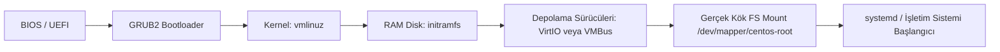
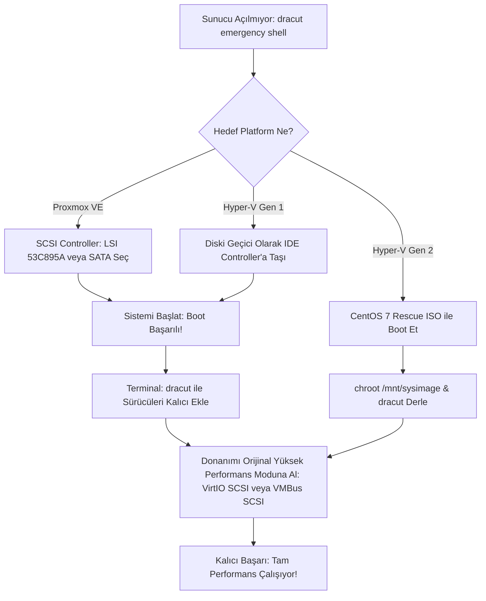

> **EN / Global Title:** *Fixing CentOS 7 Boot Failure: "dracut-initqueue: Warning: /dev/mapper/centos-root does not exist - Entering emergency mode" during VMware to Proxmox VE (VirtIO) & Hyper-V (VMBus) Migration*


Son dönemde kurumsal sanallaştırma dünyasındaki lisanslama ve maliyet değişiklikleri, sistem yöneticilerini **VMware vSphere/ESXi** ortamlarından **Proxmox Virtual Environment (PVE)** veya **Microsoft Hyper-V / Azure Stack** platformlarına doğru kitlesel bir göç sürecine itti.

Fakat ESXi üzerinde yıllardır sorunsuz çalışan bir sanal makineyi (VM) yeni sanallaştırma platformunuza aktardığınızda (ister Proxmox KVM ister Hyper-V Gen1/Gen2 olsun), özellikle **CentOS 7 / RHEL 7** tabanlı iş yüklerinde soğuk duş etkisi yaratan klasik bir felaket senaryosuyla karşılaşırsınız:

```text
[   14.285194] dracut-initqueue[384]: Warning: /dev/mapper/centos-root does not exist
[   14.285512] dracut-initqueue[384]: Warning: /dev/centos/root does not exist
Entering emergency mode. Exit the shell to continue.
Type "journalctl" to view the system logs.
dracut:/#
```

Bu hata mesajı ilk bakışta bir disk bozulması veya dosya sistemi çöküşü gibi algılansa da, temel neden fiziksel veya mantıksal bir veri kaybı değildir. Sorun; Linux çekirdeğinin yeni hipervizör platformunun sunduğu sanal I/O kontrolcüsü ile konuşabilecek sürücülere başlangıç aşamasında sahip olmamasından kaynaklanan bir donanım soyutlama uyumsuzluğudur.

Bu kriz sanallaştırma dünyasında **evrensel bir donanım soyutlama problemidir**. Bu makalede; problemin perde arkasındaki Linux boot mimarisini, sorunun hem **Proxmox (VirtIO)** hem de **Hyper-V (VMBus / LIS)** geçişlerinde neden aynı şekilde patladığını, tek bir konfigürasyonla her iki platforma da uyumlu **evrensel bir imaj hazırlama (proaktif)** yöntemini ve açılmayan sunucuları kurtarma yollarını adım adım ele alacağız.

---

## 1. Kök Neden Analizi: Linux Neden Yeni Hipervizörü Tanımıyor?

Bir Linux sunucusunun açılış mimarisi (Boot Sequence) özetle şu adımlardan geçer:



1. **GRUB2**, diskteki çekirdeği (`vmlinuz`) ve geçici kök dosya sistemini (`initramfs`) belleğe (RAM) yükler.
2. Çekirdek, gerçek disk bölümüne (`/` ya da root LVM) erişmek için gereken depolama denetleyicisi modüllerini (sürücüleri) `initramfs` içerisinden yükler.
3. Disk sürücüsü başarıyla yüklendiğinde sanal disk donanımı taranır, kök dosya sistemi (`/sysroot`) bağlanır ve yönetim `systemd`'ye devredilir.

### Problem Nerede Başlıyor?
RHEL ve CentOS 7, varsayılan kurulumunda `dracut` aracını **`hostonly="yes"`** modunda çalıştırır.

* **Host-Only Modu:** `initramfs` oluşturulurken diske gereksiz sürücüler yüklenmez; yalnızca işletim sisteminin *o an çalıştığı donanımda aktif olan sürücüler* imaja gömülür.
* Sanal makineniz VMware üzerinde çalışırken disk denetleyicisi olarak **`pvscsi` (VMware Paravirtual SCSI)** veya **`lsilogic`** kullanıyordu. Dolayısıyla `initramfs` sadece bu modülleri barındırır.
* Hedef platforma geçildiğinde donanım mimarisi tamamen değişir:
  * **Proxmox VE (KVM):** Yüksek I/O performansı için **`VirtIO SCSI`** (`virtio_scsi`, `virtio_pci`) kullanır.
  * **Microsoft Hyper-V:** Yüksek performans için **`VMBus Synthetic SCSI`** (`hv_vmbus`, `hv_storvsc`) mimarisini kullanır.
* Çekirdek açılır, `initramfs` içine bakar; ancak ne VirtIO ne de Hyper-V VMBus sürücüleri vardır!
* **Sonuç:** Çekirdek depolama denetleyicisini tanıyamaz, diski göremez, root mount zaman aşımına uğrar ve sistem `dracut:/#` acil durum kabuğuna (emergency shell) düşer.

---

## 2. Platform Karşılaştırması: Proxmox vs Hyper-V Mimari Farkı

CentOS 7'yi taşırken hedef hipervizörün çalışma prensiplerini bilmek hayat kurtarır:

| Özellik | VMware ESXi | Proxmox VE (KVM) | Hyper-V (Generation 1) | Hyper-V (Generation 2) |
| :--- | :--- | :--- | :--- | :--- |
| **Boot Türü** | BIOS / UEFI | BIOS (SeaBIOS) / UEFI (OVMF) | Legacy BIOS | Yalnızca UEFI |
| **Önerilen Disk Arayüzü** | VMware Paravirtual (pvscsi) | VirtIO SCSI (`virtio_scsi`) | IDE (Boot) veya SCSI | VMBus SCSI (`hv_storvsc`) |
| **Gerekli Kernel Modülleri** | `pvscsi`, `vmxnet3` | `virtio`, `virtio_pci`, `virtio_scsi`, `virtio_net` | `ata_piix` (IDE için) veya `hv_storvsc` | `hv_vmbus`, `hv_storvsc`, `hv_netvsc` |
| **Entegrasyon Servisi** | `open-vm-tools` | `qemu-guest-agent` | `hyperv-daemons` (LIS) | `hyperv-daemons` (LIS) |
| **Acil Kurtarma Hilesi** | - | Denetleyiciyi `LSI 53C895A` veya `SATA` yap | Diski geçici olarak `IDE` denetleyicisine bağla | IDE desteği **YOKTUR**, chroot veya VMBus şart |

> ⚠️ **Hyper-V Gen 1 vs Gen 2 Uyarısı:** Hyper-V Gen 1 sanal makinelerde IDE denetleyicisi emüle edildiği için disk IDE'ye bağlanarak `hv_storvsc` olmasa bile sistem açılabilir. Ancak **Hyper-V Generation 2 makinelerde emüle edilmiş IDE yoktur!** Sistem yalnızca UEFI ve sentetik VMBus SCSI üzerinden boot eder. Bu yüzden `hv_vmbus` ve `hv_storvsc` sürücüleri `initramfs` içinde yoksa Gen 2 makine asla açılamaz!

---

## 3. Bu Sorun Sadece CentOS 7’ye mi Özgü? (RHEL 8/9, Ubuntu, SLES ve Windows)

Sıkça sorulan sorulardan biri: *"Aynı göçü Ubuntu veya Rocky Linux ile yapsaydık yine bu hatayla karşılaşır mıydık?"*

Cevap: **Evet! Bu durum CentOS 7'ye özel bir yazılım hatası değil; depolama mimarisi değişen tüm işletim sistemlerinde farklı biçimlerde karşımıza çıkan evrensel bir çekirdek (kernel) refleksidir.**

### 3.1. RHEL / AlmaLinux / Rocky Linux / Oracle Linux (8 & 9)
CentOS 7 ile aynı şekilde `dracut` altyapısını kullanırlar. Kurulum sırasında imaj boyutunu optimize etmek için varsayılan olarak `hostonly="yes"` yapılandırması etkin bırakıldıysa, VMware'den Proxmox veya Hyper-V'ye taşındıklarında aynı şekilde `dracut emergency shell` ekranına düşerler.

### 3.2. Debian ve Ubuntu (`initramfs-tools`)
Debian tabanlı sistemler `dracut` yerine `initramfs-tools` kullanır:
* `/etc/initramfs-tools/initramfs.conf` içinde **`MODULES=most`** (Ubuntu varsayılanı) tanımlıysa, çekirdek yaygın tüm sanallaştırma sürücülerini (VirtIO ve Hyper-V dahil) imaja gömer. Bu sayede standart bir Ubuntu sunucusu genellikle taşındıktan sonra doğrudan açılır.
* Ancak sistem disk tasarrufu veya minimal bulut imajı amacıyla **`MODULES=dep`** (yalnızca mevcut donanım bağımlılıkları) modunda kurulduysa, Ubuntu da boot edemez ve `(initramfs) ALERT! /dev/disk/by-uuid/... does not exist` uyarısıyla acil durum kabuğuna düşer.

### 3.3. Windows Server: Mavi Ekran (`BSOD 0x7B`)
Aynı problem Windows dünyasında da birebir mevcuttur! VMware'den taşınan bir Windows Server'ın disk denetleyicisi Proxmox'ta aniden `VirtIO SCSI` veya Hyper-V'de VMBus SCSI olarak ayarlanırsa, Windows başlangıç anında ilgili sürücüyü (`viostor.sys`) belleğe yükleyemez ve ünlü mavi ekranı verir:
* **`INACCESSIBLE_BOOT_DEVICE` (Stop Code: `0x0000007B`)**

### Neden Sektörde En Çok "CentOS 7" Konuşuluyor?
1. **On Yıllık Kurumsal Altyapı:** 2014-2024 yılları arasında kurulan kurumsal sunucu ve veritabanlarının ezici çoğunluğu CentOS 7 üzerinde koşturuldu.
2. **Kritik Zamanlama:** VMware'in lisans politikasının değiştiği ve şirketlerin alternatiflere göç başlattığı dönem, tam da CentOS 7'nin kullanım ömrünün (EOL - Haziran 2024) bittiği döneme denk geldi.

---

## 4. Strateji 1: Planlı Göç (Proaktif Yöntem - Henüz VMware Üzerindeyken)

Eğer göçü önceden planlıyorsanız, makineyi taşımadan önce VMware üzerindeyken **tek bir konfigürasyonla hem Proxmox hem Hyper-V uyumlu evrensel (hybrid) bir `initramfs`** hazırlayabilirsiniz. Böylece diski hangi platforma takarsanız takın sorunsuz açılır!

### Adım 1.1: Evrensel Sürücü Paketini Hazırlayın
CentOS 7 terminalinde `/etc/dracut.conf.d/migration.conf` dosyasını oluşturun:

```bash
cat << 'EOF' > /etc/dracut.conf.d/migration.conf
# Hem Proxmox (KVM VirtIO) hem de Hyper-V (VMBus LIS) sürücülerini dahil et
add_drivers+=" virtio virtio_ring virtio_pci virtio_blk virtio_net virtio_scsi virtio_balloon hv_vmbus hv_storvsc hv_netvsc hv_utils hyperv_keyboard "
EOF
```

### Adım 1.2: Mevcut initramfs'i Yedekleyip Yeniden Derleyin
```bash
# 1. Mevcut imajı güvenliğe alın
cp /boot/initramfs-$(uname -r).img /boot/initramfs-$(uname -r).img.bak

# 2. Yeni sürücülerle initramfs'i zorlayarak baştan derleyin
dracut -f -v /boot/initramfs-$(uname -r).img $(uname -r)
```

### Adım 1.3: Sürücülerin İmaja Eklendiğini Doğrulayın
`lsinitrd` ile her iki platformun sürücülerinin de imajda olduğunu teyit edin:
```bash
lsinitrd /boot/initramfs-$(uname -r).img | grep -E "virtio_scsi|hv_storvsc"
```
*Çıktıda hem `virtio_scsi.ko` hem de `hv_storvsc.ko` satırlarını görüyorsanız artık imajınız hipervizör bağımsız (portable) hale gelmiştir.*

### Adım 1.4: Eski VMware Araçlarını Temizleyin
```bash
yum remove open-vm-tools vmware-tools-services -y
```

Artık sanal makinenizi kapatabilir, diski ister Proxmox VE ister Hyper-V ortamına aktarabilirsiniz.

---

## 5. Strateji 2: Kriz Masası (Reaktif Yöntem - Sunucu Taşındı ve Açılmıyor!)

Eğer makineyi önceden hazırlamadan taşıdıysanız ve konsolda `dracut:/#` prompt'unda kaldıysanız, platformunuza uygun kurtarma metodunu uygulayın:



---

### İlk Müdahale: dracut Acil Durum Kabuğundan Canlı Çıkış Hilesi (Live Bypass)

Sunucu `dracut:/#` kabuğuna düştüğünde makineyi hemen kapatmadan önce konsol üzerinden canlı bir donanım teşhisi yapabilirsiniz:

```bash
cat /proc/partitions
```

* **Durum 1 (Diskler Listelenmiyor):** Çıktıda yalnızca `ram*` veya `loop*` aygıtları varsa, çekirdek depolama kontrolcüsünü kesinlikle görmüyordur. Bu durumda doğrudan aşağıdaki Senaryo A, B veya C adımlarına geçin.
* **Durum 2 (Diskler Görünüyor, LVM İnaktif):** Eğer çıktıda diskiniz (`sda`, `vda` vb.) listeleniyor fakat kök dosya sistemi (`/dev/mapper/centos-root`) bulunamıyorsa, sürücü yüklenmiş ancak LVM birimleri henüz taranmamış olabilir. Kabukta şu iki komutu çalıştırın:
  ```bash
  lvm vgscan
  lvm vgchange -ay
  ```
  Eğer mantıksal birimler başarıyla aktif edildiyse:
  ```bash
  exit   # veya klavyeden Ctrl + D
  ```
  Sistem herhangi bir yeniden başlatmaya veya ISO'ya gerek kalmadan **kaldığı yerden boot etmeye devam eder!** Masaüstüne veya SSH'a eriştikten sonra kalıcı `dracut` derlemesini içeriden çalıştırabilirsiniz.

---

### Senaryo A: Proxmox VE İçin Hızlı Kurtarma (ISO Gerektirmez)

1. Proxmox GUI'sinden VM'i kapatın (**Stop**).
2. **Hardware** sekmesine gidin.
3. **SCSI Controller** ayarını çift tıklayın ve `VirtIO SCSI` yerine **`LSI 53C895A`** veya **`VMware PVSCSI`** seçin. *(Alternatif: Diski Detach edip SATA bus olarak bağlayın).*
4. VM'i başlatın. Sistem açılacaktır.
5. SSH / Konsol ile sisteme girip VirtIO sürücülerini kalıcı yapın:
   ```bash
   cat << 'EOF' > /etc/dracut.conf.d/virtio.conf
   add_drivers+=" virtio virtio_ring virtio_pci virtio_blk virtio_net virtio_scsi virtio_balloon "
   EOF
   dracut -f -v /boot/initramfs-$(uname -r).img $(uname -r)
   ```
6. VM'i kapatın, SCSI Controller'ı tekrar **`VirtIO SCSI`** yapın ve makineyi başlatın.

---

### Senaryo B: Hyper-V Generation 1 İçin Hızlı Kurtarma (IDE Hilesi)

Hyper-V Gen 1 makinelerde standart IDE denetleyicisi emüle edilir ve Linux çekirdeğinde IDE (`ata_piix`) sürücüsü gömülüdür:

1. Hyper-V Yöneticisi'nden sanal makineyi kapatın.
2. VM ayarlarına girin (**Settings**).
3. Diskiniz **SCSI Controller** altındaysa, diski oradan kaldırın (**Remove**).
4. **IDE Controller 0** altına gidin, **Hard Drive** ekleyin ve aynı `.vhdx` disk dosyasını buraya bağlayın.
5. Makineyi başlatın. Çekirdek IDE arayüzünü tanıyacağı için sistem açılacaktır.
6. Sisteme `root` olarak girin ve Hyper-V VMBus sürücülerini ekleyin:
   ```bash
   cat << 'EOF' > /etc/dracut.conf.d/hyperv.conf
   add_drivers+=" hv_vmbus hv_storvsc hv_netvsc hv_utils hyperv_keyboard "
   EOF
   dracut -f -v /boot/initramfs-$(uname -r).img $(uname -r)
   ```
7. Sistemi kapatın (`poweroff`). Diski tekrar **SCSI Controller** altına taşıyarak tam I/O performansına geçiş yapın.

---

### Senaryo C: SystemRescue / Minimal ISO ve chroot ile Kurtarma (En Garantili Yöntem)

Eğer Hyper-V Gen 2 kullanıyorsanız (IDE emülasyonu olmadığı için) veya Proxmox'ta donanım denetleyicisini değiştirmek sistemi açmaya yetmediyse, kurtarma medyası (**SystemRescue ISO** veya **CentOS 7 Minimal ISO**) ile sisteme cerrahi müdahale yapabilirsiniz:

#### Adım 1: Depolama Katmanını Doğrulayın
Sanal makineyi kurtarma ISO'su ile açtıktan sonra, disklerin ve LVM mantıksal birimlerinin bütünlüğünü kontrol edin:

```bash
lsblk -f
pvs && vgs && lvs
```
*Bu çıktı üzerinden işletim sisteminin kurulu olduğu kök birimi (örneğin `/dev/mapper/centos-root`) ve `/boot` bölümünün (örneğin `/dev/sda1`) aygıt isimlerini not edin.*

#### Adım 2: Hiyerarşik Mount ve chroot Ortamının Hazırlanması
Hedef işletim sisteminin dosya yapısını standart `/mnt/sysimage` dizinine bağlayıp sistem kaynaklarını aktaralım:

```bash
# 1. Kök dosya sistemini bağlayın
mkdir -p /mnt/sysimage
mount /dev/mapper/centos-root /mnt/sysimage

# 2. Boot bölümünü bağlayın
mount /dev/sda1 /mnt/sysimage/boot

# 3. Çekirdek ve donanım sözde dosya sistemlerini (Pseudo FS) aktarın
for fs in /dev /proc /sys /run; do
    mount --bind $fs /mnt/sysimage$fs
done

# 4. İzole çalışma ortamına (chroot) geçiş yapın
chroot /mnt/sysimage
```

#### Adım 3: Çekirdek Sürücülerinin Varlığını Doğrulayın
`dracut` çalıştırmadan önce, sistem çekirdeğinde ihtiyaç duyulan depolama ve hipervizör modüllerinin derlenmiş durumda olduğunu döngüyle kontrol edin:

```bash
for driver in virtio_pci virtio_scsi virtio_blk hv_vmbus hv_storvsc ahci ata_piix; do
    modinfo $driver > /dev/null 2>&1 && echo "[ OK ] $driver çekirdekte mevcut" || echo "[ UYARI ] $driver bulunamadı"
done
```

#### Adım 4: initramfs İmajını Gerekli Sürücülerle Yeniden İnşa Edin
Mevcut imajı güvenceye aldıktan sonra `dracut` ile hem KVM (VirtIO) hem Hyper-V (VMBus) hem de genel AHCI/IDE sürücülerini başlangıç imajına enjekte edin:

```bash
# 1. Mevcut imajı yedekleyin
cp /boot/initramfs-$(uname -r).img /boot/initramfs-$(uname -r).img.orig

# 2. Çoklu hipervizör sürücüleriyle derleyin
dracut -f -v --add-drivers "ahci ata_piix virtio_pci virtio_scsi virtio_blk vmw_pvscsi hv_vmbus hv_storvsc" \
/boot/initramfs-$(uname -r).img $(uname -r)

# 3. İmaj içeriğinde sürücülerin yer aldığını teyit edin
lsinitrd /boot/initramfs-$(uname -r).img | grep -E "virtio_scsi|hv_storvsc"
```

#### Adım 5: Dosya Sistemlerini Güvenle Ayırıp Sistemi Yeniden Başlatın
```bash
exit
umount -R /mnt/sysimage
reboot
```
ISO'yu çıkarın; sunucunuz artık hem Proxmox VirtIO SCSI hem de Hyper-V VMBus mimarisinde sorunsuzca boot edecektir.

---

> 💡 **P2V (Fizikselden Sanala) Geçiş Yapanlar İçin Not:**
> Bu problem sadece V2V (VMware -> Proxmox/Hyper-V) göçlerinde değil; eski bir fiziksel sunucuyu (örneğin Oracle Database 11g çalışan bir Supermicro/HP makineyi) **Clonezilla, Redo Backup veya Veeam** ile Proxmox veya Hyper-V sanalına aktardığınızda da (P2V) birebir aynı şekilde yaşanır. Yukarıdaki kurtarma adımları P2V dönüşümlerinde de hayat kurtarır.

---

## 6. Sinsi Tuzaklar ve İleri Düzey Sorun Giderme (Red Hat KB Notları)

Bazen tüm sürücüleri doğru yüklemenize rağmen sistem yine de açılmayabilir. Red Hat Bilgi Bankası (KB) ve üretim ortamı analizlerinde tespit edilen şu iki kritik tuzağa dikkat edin:

### 6.1. Sinsi "LVM Filtresi" Tuzağı (`/etc/lvm/lvm.conf`)
VMware üzerinde optimize edilmiş bazı kurumsal CentOS 7 sunucularda disk tarama süresini kısaltmak amacıyla `/etc/lvm/lvm.conf` dosyasında katı bir aygıt filtresi tanımlanmış olabilir:
```text
filter = [ "a|^/dev/sd.*|", "r|.*|" ]
```
Bu konfigürasyon, sistemi Proxmox üzerinde **VirtIO Block (`/dev/vda`)** arayüzüyle açtığınızda felakete yol açar! Çekirdek VirtIO sürücüsünü başarıyla yükleyip `/dev/vda` diskini görse bile, LVM yazılımı filtreye takıldığı için diski **kasıtlı olarak görmezden gelir (ignore eder)**.
* **Çözüm:** Rescue ortamında `/etc/lvm/lvm.conf` dosyasını açıp filtre kuralını tüm diskleri kapsayacak şekilde düzenleyin:
  ```text
  filter = [ "a|.*|" ]
  ```

### 6.2. GRUB Menüsünden "Eski Çekirdek" (Fallback Kernel) ile Açma
Sunucunuz daha önce en az bir kez `yum update` gördüyse, diskte birden fazla çekirdek sürümü kuruludur. Çoğu zaman önceki çekirdeğin `initramfs` imajı genel donanım sürücülerine sahip olabilir.
* Proxmox veya Hyper-V konsolunda sanal makine başlarken **Shift** veya **Esc** tuşuna basarak GRUB menüsünü açın.
* Listeden **bir önceki çekirdek sürümünü (ikinci sıradakini)** seçerek başlatmayı deneyin.
* Eğer sistem bu çekirdekle açılırsa, hiçbir kurtarma medyasına (ISO) ihtiyaç duymadan doğrudan aktif oturum açabilir ve ana çekirdeğin `initramfs` dosyasını içeriden tek bir `dracut` komutuyla onarabilirsiniz.

---

## 7. Göç Sonrası Kritik İnce Ayarlar: Network & Entegrasyon Servisleri

İşletim sistemi açıldıktan sonra sağlıklı bir üretim ortamı için şu iki kritik konfigürasyonu tamamlamalısınız:

### 7.1. Ağ Arayüzü İsmi ve Yapılandırması (Network Interface)
VMware'deki `vmxnet3` sürücüsü arayüzü `ens192` veya `ens160` olarak adlandırırken;
* **Proxmox (VirtIO):** Arayüz genellikle `ens18` veya `eth0` olur.
* **Hyper-V (NetVSC):** Arayüz genellikle `eth0` olur.

Ağ kartınız IP alamazsa:
```bash
# Yeni arayüzün adını öğrenin:
ip link show

# /etc/sysconfig/network-scripts/ dizinindeki eski ifcfg dosyasını güncelleyin:
cd /etc/sysconfig/network-scripts/
mv ifcfg-ens192 ifcfg-ens18   # (veya Hyper-V için ifcfg-eth0)

# Dosya içindeki NAME ve DEVICE satırlarını yeni isimle değiştirin:
sed -i 's/ens192/ens18/g' ifcfg-ens18

# Varsa eski VMware MAC adresi (HWADDR) satırını silin veya güncelleyin
systemctl restart network
```

### 7.2. Entegrasyon Servislerini Kurun

#### Proxmox VE İçin:
```bash
yum install qemu-guest-agent -y
systemctl enable --now qemu-guest-agent
```
*(Proxmox Web Arayüzünde **Options > QEMU Guest Agent: Enabled** yapıp sanal makineyi tam kapatıp açın).*

#### Hyper-V İçin:
```bash
yum install hyperv-daemons -y
systemctl enable --now hypervkvpd hypervvssd
```
*(Bu servisler Hyper-V Host'un sanal makine IP adresini görmesini ve VSS anlık yedekleme almasını sağlar).*

---

## 8. Üretime Hazır Göç Kontrol Listesi (Checklist)

| Aşama | İşlem / Kontrol Adımı | Proxmox VE | Hyper-V |
| :--- | :--- | :---: | :---: |
| **Göç Öncesi** | VMware snapshot'ları temizlendi ve tam yedek alındı | [ ] | [ ] |
| **Göç Öncesi** | Evrensel `initramfs` (VirtIO + VMBus) derlendi | [ ] | [ ] |
| **Göç Öncesi** | `open-vm-tools` kaldırıldı | [ ] | [ ] |
| **VM Yapılandırması** | Disk Denetleyicisi seçimi | `VirtIO SCSI single` | `VMBus SCSI (Gen2)` |
| **VM Yapılandırması** | Disk İnce Ayarları | `Discard=on`, `SSD=on` | Dynamic / Fixed VHDX |
| **VM Yapılandırması** | CPU Modeli | `host` (Maksimum IPC/AES) | Default Virtual CPU |
| **Göç Sonrası** | Ağ kartı adı (`ens18` / `eth0`) ve IP ayarları güncellendi | [ ] | [ ] |
| **Göç Sonrası** | İlgili Agent kuruldu (`qemu-guest-agent` / `hyperv-daemons`) | [ ] | [ ] |
| **Göç Sonrası** | Başarılı açılış sonrası ilk tam yedek (PVE Backup / Hyper-V Backup) alındı | [ ] | [ ] |

---

## Özet ve Son Söz

İster açık kaynaklı **Proxmox VE**, ister kurumsal **Microsoft Hyper-V / Azure Stack** olsun; VMware dışına çıkıldığında karşılaşılan açılış hatalarının temel sebebi diskin bozulması değil, **Linux çekirdeğinin `host-only` sürücü politikasıdır**.

Göç öncesinde `initramfs` içerisine hem `virtio` hem de `hv_storvsc` modüllerini ekleyerek ortamlar arası geçişi tek komutla pürüzsüz hale getirebilir; kriz anlarında ise donanım emülasyonu hileleriyle (LSI/IDE) sistemi kurtarma medyasına dahi ihtiyaç duymadan ayağa kaldırabilirsiniz.

Saygilarimla Faruk GULER / Sysadmin