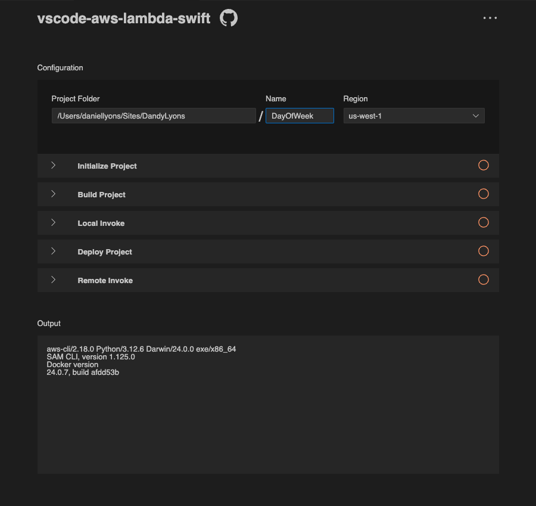

# An Introduction to Swift on the Server

Swift has long been viewed as "that Apple language" or "that iPhone language", and to be fair, for a while that was a reasonably accurate description of the language and ecosystem in the early days. But it hasn't been true for a very long time. Swift can now be run on Apple platforms, Linux, Windows, embedded systems (like IoT devices and Raspberry Pi's), Wasm, and server. In fact, it's harder to think of places that Swift **can't** run. 

My goal today is to talk to the "typical" Swift developer and to show them why and how they should get started developing Swift on Server. That would be Swift developers who are used to developing native apps for Apple platforms. This article assumes you have a basic knowledge of how to make a network request from an application. Today, we'll be talking about the other side of that equation. Who receives your network request and how do they compute and send your response? I hope that I can broaden your mind to the possibilities of Swift on Server, and make it less daunting to jump in and get your feet wet. 

**There has never been an easier time to get started!**

---
## Why Swift Developers Should Deploy on Server

At the end of the day, I really only see three reasons why someone should start server-side development: 

1. **They find it fun and/or interesting**: If it's interesting to you, then just do it. As we'll see below, it's cheap (effectively free), and it's easy to get started. So there's no real reason not to try it. 
2. **It solves a problem**: Exploration is fun and all. But we have real problems to solve, and servers can be a very effective tool in your belt. Like any other technology, servers give you superpowers!
3. **To learn**: There are many problems that you could solve today with servers that you are probably unaware of. You can't find out until you experience it. You're probably already paying for a lot of services that are much cheaper to implement on your own and you didn't realize how easy it is to do so. 

### Server Superpowers

I'd like to convince you that Swift on Server can help you with #2 (solving your problems). Perhaps a better way to think about it is superpowers. We often want to learn or do a thing in order to solve a problem. This is not a bad way to look at the world, but it is limiting. What if there are problems that you are unaware of? Will you never look for a solution to that problem until you realize it's a problem? Also, does everything have to solve a problem? Videogames don't exactly solve problems, but they're still valuable. 

This is why I think it's helpful to think of it in terms of superpowers. In other words, think of it in terms of new capabilities. When you learn of new capabilities, you can begin to think of new ways to use those capabilities (applications). But if you never knew you had those capabilities in the first place, you wouldn't have thought of those applications. For example, in the early 2000s, I remember when cell phones were first adding GPS chips. I remember thinking it was "neat", but not all that useful. Why would I need that? I couldn't have imagined how that capability would unlock turn-by-turn maps directions, ride sharing apps, Find My and so many other things. The point is, **you can't determine what is worth doing, until you determine what can be done**. 

So what are the superpowers that servers enable? Well you're likely already aware of most of the capabilities: file storage, data syncing, giving mobile devices access to more powerful computing etc. What you might not be aware of is how approachable these capabilities are. You've probably been delegating them to some other service provider like iCloud, Firebase, AWS or many others. But did you know that you can develop many of these capabilities yourself, in Swift? You can share parts of your codebase in multiple platforms. You can develop in a language that you are familiar with. 

### Swift's Superpowers on Server

Swift has a few characteristics that make it particularly well-suited for servers. Swift is fast. It interacts directly with the hardware, without a virtual machine or interpreter unlike Java, Python, and JavaScript. It also doesn't rely on a garbage collector unlike Go and C#. Swift enforces memory safety unlike C or C++. And Swift is embarking on an ambitious albeit painful journey toward enforcing [data race safety](https://www.swift.org/migration/documentation/swift-6-concurrency-migration-guide/dataracesafety/). 

The biggest problem I see with Swift on the Server is not the language. It's the ecosystem. The cold hard truth is that the server-side Swift community is not nearly as big as say the Go or Node.js communities. This means far less tools and resources. However the future is looking extremely bright for server side Swift. [Hummingbird just released 2.0](https://hummingbird.codes/) which is Swift 6 and structured concurrency native. Apple released [OpenAPI generator](https://developer.apple.com/videos/play/wwdc2023/10171/) which makes it really easy to define server endpoints, client-side API and documentation all from one simple YAML file. And Swift has an extremely powerful future with [Distributed Actors](https://developer.apple.com/videos/play/wwdc2022/110356/). Don't look at where Swift on Server is now. Look at where it's going, and where it's going looks pretty good. 

### There's No App Store Review

One of the most refreshing reasons to get into server side development is there is no App Store review. You can simply release whenever you feel like. You don't have to wait hours, even weeks for esoteric review to give you permission to release. Release when you want to, how you want to. 

### Instant Cross-Platform Worldwide Distribution

There is no platform with a bigger distribution than the open web. If you deploy to server, then you have deployed to Mac, Windows, Linux, iOS, Android, even Nintendo Switch. If it has a browser, then it can possibly communicate with your server and that is powerful!

### It's Free to Get Started

Apple development costs a minimum of $100 a year. That's really not too bad, but it is definitely not free. But servers are definitely not free. Servers are physical computers that cost real money to manufacture. They take up actual physical space, meaning they need actual real estate somewhere. They require electricity, and software updates, and security updates, and maintenance. None of that is cheap or free. 

But it is effectively a solved problem. Companies have long ago abstracted away the cost of buying, housing, and maintaining physical servers. Instead, they maintain the servers and you pay a fee to host on their servers. This dramatically simplifies logistics. It also lowers the cost since they can split their maintenance cost amongst their many customers. If you did it yourself, you would have to eat those maintenance costs yourself. Think of this model as being kind of like renting an apartment. You pay for the apartment whether or not you sleep in the apartment. Likewise, you pay for the server, whether or not you have users. 

Then there's another type of deployment called **serverless** which in the right conditions can make deployment effectively free (with some asterisks). Instead of paying for the server, you are paying for the usage. And you only pay for what you use. So if no one uses your server then you pay nothing. I know it sounds too good to be true, but it's not! We'll talk about it more below. 

### It's Easy to Get Started

Lastly, it has never been easier to get started. Swift has a long history of server-side frameworks. They have well established patterns and documentation. Today we will be learning a solution that requires almost no prior knowledge of web development. 

---
## Defining Terms

Before we get started, it's important to have a base understanding of web development. Let's define some terms we'll be using. 

### Server

>Strictly speaking, the term server refers to a computer **program** or **process** (running program)
>- [Wikipedia](https://en.wikipedia.org/wiki/Server_(computing))

A server is just a _thing_ that serves data. What kind of thing is it? Hardware? Software? Unfortunately the term is used for both (which can be quite confusing). At the end of the day, think of it as a thing that serves data.  

### Serverless

"Serverless" is another term that you should get familiar with. And unfortunately it's a little extra confusing. It sounds like it means that there is no server. But there actually is a server somewhere. Many servers actually. The real reason why it's called serverless is because **you, yourself, do not have to care about the server**. The server is an implementation detail. You just send it to them and let them figure it out for you. And if you all of a sudden have a ton of new users, you don't have to buy more servers. The serverless provider will just simply allocate more servers for you, ensuring that your service doesn't go down. (But that will cost more money.)

Fireship has a very good introduction to [serverless computing](https://www.youtube.com/watch?v=W_VV2Fx32_Y) as a concept.

Deciding between servers and serverless is a gigantic topic far beyond the scope of this article. Don't worry about this decision when you are getting started. You will not be boxed into these decisions forever. Whatever code you write can be ported between each of these deployment options, fairly easily. For an absolute beginner, AWS Lambda is a great solution to get started, because you only pay for what you use, and there is a very generous free tier. 

### FaaS (Function as a Service)

[FaaS](https://en.wikipedia.org/wiki/Function_as_a_service) is a type of "serverless" computing. It's designed to treat your code like small on-demand functions that are only running when they are needed. When they are not being used, they will shut themselves down (saving you money). When they are being used, they will take a little bit longer to respond, because they must first start up. This is called a _cold start_. Then they will stay up for a period of time for future requests. The system will attempt to anticipate user demand to minimize cold starts (thus faster response time for your users), while also minimizing idle time (thus lower costs for you). 

### AWS Lambda

So what is AWS Lambda? 

AWS stands for Amazon Web Services. While you might know them for their store, they probably make far more profit from AWS. AWS is the "cloud" that powers Netflix, Twitch, Disney, Airbnb and most of the internet. That doesn't mean it's perfect, but it does mean that it is very reliable. They have to be if they want to keep those customers happy. 

[AWS Lambda](https://aws.amazon.com/lambda/) is the first and most popular FaaS vendor. 

---
## How to Get Started

Today we'll be using a tool that abstracts away almost all of the complexity of deploying Swift to AWS Lambda. It's a VS Code extension called **"VSCode AWS Lambda Swift"**. We'll also be following along with a [talk by Sebastien Stormacq](https://www.youtube.com/watch?v=M1POAEPATFo) from the Serverside.swift 2024 conference. 

### Prerequisites

- You have a basic understanding of Swift and SPM
- You have VS Code installed. 
  - Tim Condon has a fantastic talk about this. [Watch it here](https://www.youtube.com/watch?v=bH2jpNZmx4Y). 
- You have the Swift extension installed on VS Code:
  - Read the official [blog post here](https://www.swift.org/blog/vscode-extension/). 
- You have created an AWS account ([See the docs.](https://docs.aws.amazon.com/accounts/latest/reference/manage-acct-creating.html))
- You have downloaded and installed the [AWS CLI](https://aws.amazon.com/cli/). 
  - You have created at least one role on [AWS](https://docs.aws.amazon.com/IAM/latest/UserGuide/id_roles.html).
  - You have configured your AWS CLI to use the credentials from your AWS role. [See docs here](https://docs.aws.amazon.com/cli/v1/userguide/cli-configure-role.html).
  - See [Gotchas](#gotchas) below.
- You have the [AWS SAM CLI](https://docs.aws.amazon.com/serverless-application-model/latest/developerguide/install-sam-cli.html) installed. 
  - **SAM** is a tool provided by AWS to make it easier to port code over to AWS Lambda. Basically SAM will write a bunch of boilerplate for us. Sebastien talks about it much more in depth in [the talk](https://www.youtube.com/watch?v=M1POAEPATFo) I mentioned earlier. 
- In order to build and test locally, you must have Docker installed and configured on your machine.

### Install "VSCode AWS Lambda Swift" Extension

Assuming we have our prerequisites finished, you actually have done almost all of the hard work. Now, let's install the [VSCode AWS Lambda Swift](https://marketplace.visualstudio.com/items?itemName=MarwaneKoutar.vscode-aws-lambda-swift) Extension. Open the extensions marketplace in VS Code, search for it, and click **Install**. Don't forget. The extension is open-source and you can find its repo [here](https://github.com/swift-server-community/vscode-aws-lambda-swift-sam).

### Use, Test, and Iterate

Now open the command palette in VS Code so that we can search for the command we want to use. One way to do this is to press CMD+Shift+P. Now type in `AWS Lambda Swift: Open AWS Lambda Swift Dashboard`. You should see the command appear in the search results. When you run this command, it will open a dashboard for you to use. 

The first thing you should do is click the button with the three dots at the top right. Then click "Check prerequisites". The extension will then check if you have the correct tools installed on your system. 

In the top section we'll tell the extension where to generate files. We can keep this the same. Next, you must name your project. Then choose a region that is somewhere near you. ([Read more about regions in the docs here](https://docs.aws.amazon.com/en_us/AWSEC2/latest/UserGuide/using-regions-availability-zones.html)). Next there are five workflows. Only use the workflows that you need. 

#### Initialize Project

This workflow will generate the boilerplate code for you. Pick a template. Read the very helpful descriptions to understand how they work. Look at the diagram picture to understand the architecture. 

At the time of writing, there are 5 templates. I want to highlight a few: 
- `api-to-lambda`: this is the simplest to setup and the one I'd recommend starting with
- `openapi-to-lambda`: this allows you to define your endpoints in a simple YAML format. Then the OpenAPI generator will generate the Swift endpoints, Swift model types, and the server API documentation for you automatically!
- `scheduler-to-lambda`: this allows you to define a lambda function that will work during a predetermined schedule. 

#### Build Project

This builds the project locally. 

#### Local Invoke

This will house your Swift code in a container, locally on your machine so that you can test its functionality. 

#### Deploy Project

This will follow the directions in your SAM declaration (the `template.yml` file) to deploy your code to AWS Lambda. Once it has been deployed, it will give you the URL, and you can try it immediately. If you have a client, for example an iPhone app, this is the URL that you will call in your network request. 

#### Remote Invoke

Remote Invoke allows you to call the Lambda function directly from VS Code. Simply select the Function, the Event, and the Stack Name, then click **Invoke**. 

## Gotchas

When I set up my AWS CLI, I ran `aws configure` to give it my credentials. It's fairly straightforward. Just answer the questions. However I had a typo in one of my answers. It asks which region should be your default. (A region is effectively which datacenter should Amazon host your code in.) I wrote `us-west` when I should have written `us-west-1`. Because of this, the "VSCode AWS Lambda Swift" extension produced an error saying that it could not fetch the AWS regions. After I corrected my configuration, then the extension was able to fetch the regions. 

---
## Next Steps

Now that you've taken your first steps into Swift on Server development, here are some suggestions for further learning and exploration:

### Learn HTTP Basics

Understanding the fundamentals of HTTP (Hypertext Transfer Protocol) is crucial for server-side development. Here are some key areas to focus on:

1. HTTP Methods (GET, POST, PUT, DELETE, etc.)
2. Status Codes (200 OK, 404 Not Found, 500 Internal Server Error, etc.)
3. Headers and their purposes
4. Request and Response structures
5. RESTful API design principles

Resources:
- [MDN Web Docs: HTTP](https://developer.mozilla.org/en-US/docs/Web/HTTP)
- [RESTful API Design - Best Practices](https://restfulapi.net/)

### Learn Hummingbird or Vapor

While AWS Lambda is great for getting started, you might want to explore more comprehensive Swift server-side frameworks. Two popular options are:

1. **Hummingbird**: A lightweight and fast server-side Swift framework.
   - [Hummingbird Official Website](https://hummingbird.codes/)
   - [Hummingbird GitHub Repository](https://github.com/hummingbird-project/hummingbird)

2. **Vapor**: A popular, feature-rich web framework for Swift.
   - [Vapor Official Website](https://vapor.codes/)
   - [Vapor Documentation](https://docs.vapor.codes/)

Both frameworks offer different approaches and feature sets. Explore them to see which one aligns better with your project needs and personal preferences.

### Recommended Resources

To deepen your understanding of Swift on Server and serverless architecture, consider the following resources:

- [Swift On Server.com](https://swiftonserver.com/)
  - [Introduction to Hummingbird 2](https://www.youtube.com/watch?v=FHO_BfidQlQ)
  - [Swift for WebAssembly](https://www.youtube.com/watch?v=cJyNok8OAuE&t=903s)
- [ServerSide.swift Conference](https://www.serversideswift.info/) - Annual conference dedicated to Swift on the server

### Practice Projects

The best way to learn is by doing. Here are some project ideas to get you started:

1. Build a simple REST API for a todo list application
2. Create a weather data aggregator that fetches data from multiple sources
3. Develop a basic chat server using WebSockets
4. Build a file storage and sharing service
5. Create a simple blog engine with a JSON API

Remember, the key to mastering Swift on Server is consistent practice and staying curious. Don't be afraid to experiment with different frameworks, architectures, and deployment strategies. As you gain more experience, you'll develop a better understanding of when to use serverless functions like AWS Lambda and when to opt for a full-fledged server application.

Happy coding, and welcome to the exciting world of Swift on Server!