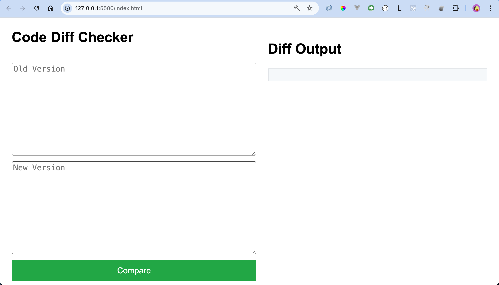

# Code or Text Difference Checker - Browser Extension

[](LICENSE)

## Overview

**Code/text Diff Checker** is a simple browser extension that allows you to visually compare differences between two blocks of code or text. It highlights added, removed, and unchanged lines in a clean and intuitive interface. Whether you're reviewing code changes or simply comparing text, this tool makes it easier to spot differences.

## Features

- Compare two blocks of text side-by-side.
- Highlights added, removed, and unchanged lines.
- Easy to use in any modern web browser.

## Screenshot

 


### For Developers

If you want to contribute to this project, you can install and build the project locally:

1. **Clone the repository:**

```bash
git clone https://github.com/CodeLeom/diff-checker
cd diff-checker
```

2. **Install dependencies:**

You will need Node.js installed on your machine.

```bash
npm install
```

3. **Build the extension:**

```bash
npx webpack --mode production
```

This will generate the dist/bundle.js file in the dist/ directory, which the extension will use.

> run the local preview on your browser by opening the index.html on the browser or through live server.

### Contributing

We welcome contributions to improve the Code/Text Diff Checker! Here’s how you can get involved:

#### Reporting Issues

If you encounter bugs, have suggestions, or want to request features, feel free to open an issue on GitHub. Please include:

>A detailed description of the issue.
>Steps to reproduce, if applicable.
>Screenshots, code snippets, or anything else that can help us understand the problem.

#### Making a Contribution

Fork the repository and create your branch from main:

```bash
git checkout -b feature/your-feature-name
```

**Make your changes:** Work on the feature or fix you want to contribute. Make sure to test locally and ensure everything is working correctly.

**Commit your changes:** Write clear and descriptive commit messages.
**Sign your commit:** Here, it is needed to add sign-off information to the commit to accept the "Developer Certificate of Origin" (https://developercertificate.org). 

```bash
 git commit -S -m "feat: add feature/fix description here"
```

Push to your branch:

```bash
git push origin feature/your-feature-name
```

**Create a pull request:** Go to the Pull Requests tab on GitHub, and submit your pull request against the main branch. We’ll review it as soon as possible!

This project is licensed under the MIT License. Feel free to use, modify, and distribute this code as you like.

**Acknowledgments:**

diff library for helping with the text diff comparison.

Thank you to all the contributors and open-source maintainers!
